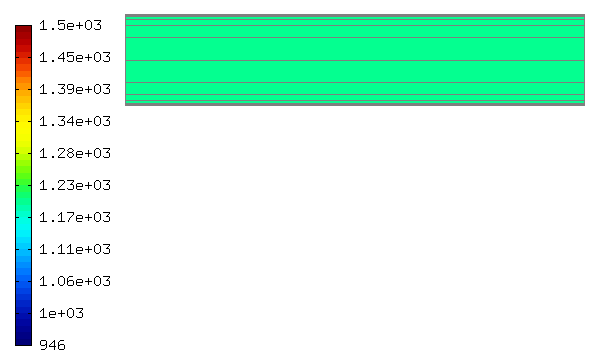
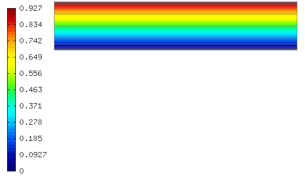
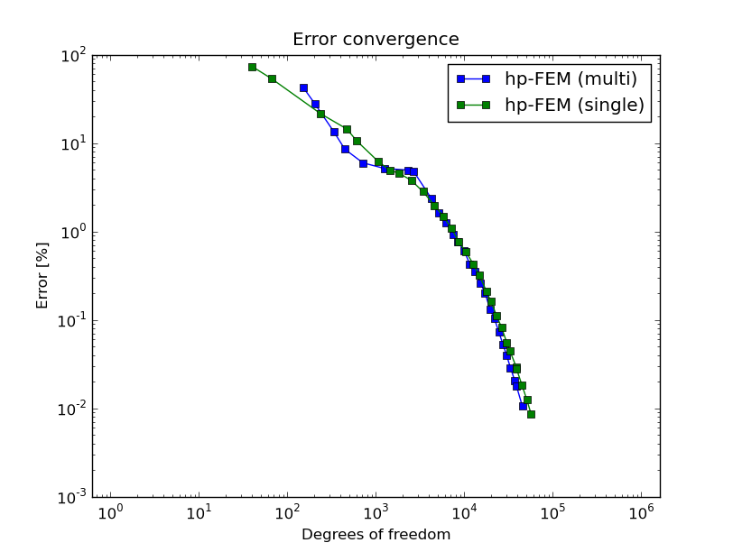

Examples
========

This section contains the description of selected `examples 
<http://hpfem.org/git/gitweb.cgi/hermes2d.git/tree/HEAD:/examples>`_.
Its purpose is to complement rather than duplicate the information 
in the source code.

Saphir
------

**Git reference:** Example `saphir <http://hpfem.org/git/gitweb.cgi/hermes2d.git/tree/HEAD:/examples/saphir>`_.

This is a standard nuclear engineering benchmark (IAEA number EIR-2) describing 
an external-force-driven configuration without fissile materials present, using one-group 
neutron diffusion approximation

.. math::
    :label: saphir

       -\nabla \cdot (D(x,y) \nabla \Phi) + \Sigma_a(x,y) \Phi = Q_{ext}(x,y).

The domain of interest is a 96 x 86 cm rectangle consisting of five regions:

.. image:: img/saphir/saphir.png
   :align: center
   :width: 400
   :height: 400
   :alt: Schematic picture for the saphir example.

The unknown is the neutron flux $\Phi(x, y)$. The values of the diffusion coefficient 
$D(x, y)$, absorption cross-section $\Sigma_a(x, y)$ and the source term $Q_{ext}(x,y)$
are constant in the subdomains. The source $Q_{ext} = 1$ in areas 1 and 3 and zero 
elsewhere. Boundary conditions for the flux $\Phi$ are zero everywhere. 

It is worth noticing that different material parameters can be handled using a separate weak form 
for each material:

::

    // Bilinear form (material 1)  
    template<typename Real, typename Scalar>
    Scalar bilinear_form_1(int n, double *wt, Func<Real> *u, Func<Real> *v, Geom<Real> *e, ExtData<Scalar> *ext)
    {
      return D_1 * int_grad_u_grad_v<Real, Scalar>(n, wt, u, v) 
             + SIGMA_A_1 * int_u_v<Real, Scalar>(n, wt, u, v);
    }

    // Bilinear form (material 2)
    template<typename Real, typename Scalar>
    Scalar bilinear_form_2(int n, double *wt, Func<Real> *u, Func<Real> *v, Geom<Real> *e, ExtData<Scalar> *ext)
    {
      return D_2 * int_grad_u_grad_v<Real, Scalar>(n, wt, u, v) 
             + SIGMA_A_2 * int_u_v<Real, Scalar>(n, wt, u, v);
    }

    // Bilinear form (material 3)
    template<typename Real, typename Scalar>
    Scalar bilinear_form_3(int n, double *wt, Func<Real> *u, Func<Real> *v, Geom<Real> *e, ExtData<Scalar> *ext)
    {
      return D_3 * int_grad_u_grad_v<Real, Scalar>(n, wt, u, v) 
             + SIGMA_A_3 * int_u_v<Real, Scalar>(n, wt, u, v);
    }

    // Bilinear form (material 4)
    template<typename Real, typename Scalar>
    Scalar bilinear_form_4(int n, double *wt, Func<Real> *u, Func<Real> *v, Geom<Real> *e, ExtData<Scalar> *ext)
    {
      return D_4 * int_grad_u_grad_v<Real, Scalar>(n, wt, u, v) 
             + SIGMA_A_4 * int_u_v<Real, Scalar>(n, wt, u, v);
    }

    // Bilinear form (material 5)
    template<typename Real, typename Scalar>
    Scalar bilinear_form_5(int n, double *wt, Func<Real> *u, Func<Real> *v, Geom<Real> *e, ExtData<Scalar> *ext)
    {
      return D_5 * int_grad_u_grad_v<Real, Scalar>(n, wt, u, v) 
             + SIGMA_A_5 * int_u_v<Real, Scalar>(n, wt, u, v);
    }

Recall that this is not the only way to handle spatially-dependent material parameters. Alternatively, one can define 
a global function returning material parameters as a function of spatial coordinates. This was done, e.g., 
in the tutorial examples `07 <http://hpfem.org/git/gitweb.cgi/hermes2d.git/blob/HEAD:/tutorial/07-general>`_ 
and `12 <http://hpfem.org/git/gitweb.cgi/hermes2d.git/blob/HEAD:/tutorial/12-adapt-general>`_.

The weak forms are associated with element material flags (coming from the mesh file) as follows:

::

    // initialize the weak formulation
    WeakForm wf(1);
    wf.add_biform(0, 0, bilinear_form_1, bilinear_form_ord, SYM, 1);
    wf.add_biform(0, 0, bilinear_form_2, bilinear_form_ord, SYM, 2);
    wf.add_biform(0, 0, bilinear_form_3, bilinear_form_ord, SYM, 3);
    wf.add_biform(0, 0, bilinear_form_4, bilinear_form_ord, SYM, 4);
    wf.add_biform(0, 0, bilinear_form_5, bilinear_form_ord, SYM, 5);
    wf.add_liform(0, linear_form_1, linear_form_ord, 1);
    wf.add_liform(0, linear_form_3, linear_form_ord, 3);

Sample results of this computation are shown below.

Solution:

.. image:: img/saphir/saphir-sol.png
   :align: center
   :width: 600
   :height: 400
   :alt: Solution to the saphir example.

Final mesh (h-FEM with linear elements):

.. image:: img/saphir/saphir-mesh-h1.png
   :align: center
   :width: 440
   :height: 400
   :alt: Final finite element mesh for the saphir example (h-FEM with linear elements).

Final mesh (h-FEM with quadratic elements):

.. image:: img/saphir/saphir-mesh-h2.png
   :align: center
   :width: 440
   :height: 400
   :alt: Final finite element mesh for the saphir example (h-FEM with quadratic elements).

Final mesh (hp-FEM):

.. image:: img/saphir/saphir-mesh-hp.png
   :align: center
   :width: 440
   :height: 400
   :alt: Final finite element mesh for the saphir example (hp-FEM).

DOF convergence graphs:

.. image:: img/saphir/conv_dof.png
   :align: center
   :width: 600
   :height: 400
   :alt: DOF convergence graph for example saphir.

CPU time convergence graphs:

.. image:: img/saphir/conv_cpu.png
   :align: center
   :width: 600
   :height: 400
   :alt: CPU convergence graph for example saphir.

Iron-Water
----------

**Git reference:** Example `iron-water <http://hpfem.org/git/gitweb.cgi/hermes2d.git/tree/HEAD:/examples/iron-water>`_.

This example is very similar to the example "saphir", the main difference being that 
it reads a mesh file in the exodusii format (created by Cubit). This example only builds 
if you have the `ExodusII <http://sourceforge.net/projects/exodusii/>`_ and 
`NetCDF <http://www.unidata.ucar.edu/software/netcdf/>`_ libraries installed on your system and 
the variables WITH_EXODUSII, EXODUSII_ROOT and NETCDF_ROOT defined properly. 
The latter can be done, for example, in the CMake.vars file as follows:

::

    SET(WITH_EXODUSII YES)
    SET(EXODUSII_ROOT /opt/packages/exodusii)
    SET(NETCDF_ROOT   /opt/packages/netcdf)

The mesh is now loaded using the ExodusIIReader (see 
the `mesh_loader.h <http://hpfem.org/git/gitweb.cgi/hermes2d.git/blob/HEAD:/src/mesh_loader.h>`_ file):

::

    // Load the mesh
    Mesh mesh;
    ExodusIIReader mloader;
    if (!mloader.load("iron-water.e", &mesh)) error("ExodusII mesh load failed.");

The model describes an external-force-driven configuration without fissile materials present.
We will solve the one-group neutron diffusion equation

.. math::
    :label: iron-water

       -\nabla \cdot (D(x,y) \nabla \Phi) + \Sigma_a(x,y) \Phi = Q_{ext}(x,y).

The domain of interest is a 30 x 30 cm square consisting of four regions.
A uniform volumetric source is placed in water in the lower-left corner 
of the domain, surrounded with a layer of water, a layer of iron, and finally
another layer of water:

.. image:: img/iron-water/iron-water.png
   :align: center
   :width: 400
   :height: 400
   :alt: Schematic picture for the iron-water example.

The unknown is the neutron flux $\Phi(x, y)$. The values of the diffusion coefficient 
$D(x, y)$, absorption cross-section $\Sigma_a(x, y)$ and the source term $Q_{ext}(x,y)$
are constant in the subdomains. The source $Q_{ext} = 1$ in area 1 and zero 
elsewhere. The boundary conditions for this problem are zero Dirichlet (right and top edges)
and zero Neumann (bottom and left edges). Sample results of this computation are shown below.

Solution:

.. image:: img/iron-water/iron-water-sol.png
   :align: center
   :width: 600
   :height: 400
   :alt: Solution to the iron-water example.

Final mesh (h-FEM with linear elements):

.. image:: img/iron-water/iron-water-mesh-h1.png
   :align: center
   :width: 440
   :height: 400
   :alt: Final finite element mesh for the iron-water example (h-FEM with linear elements).

Final mesh (h-FEM with quadratic elements):

.. image:: img/iron-water/iron-water-mesh-h2.png
   :align: center
   :width: 440
   :height: 400
   :alt: Final finite element mesh for the iron-water example (h-FEM with quadratic elements).

Final mesh (hp-FEM):

.. image:: img/iron-water/iron-water-mesh-hp.png
   :align: center
   :width: 440
   :height: 400
   :alt: Final finite element mesh for the iron-water example (hp-FEM).

DOF convergence graphs:

.. image:: img/iron-water/conv_dof.png
   :align: center
   :width: 600
   :height: 400
   :alt: DOF convergence graph for example iron-water.

CPU time convergence graphs:

.. image:: img/iron-water/conv_cpu.png
   :align: center
   :width: 600
   :height: 400
   :alt: CPU convergence graph for example iron-water.

Nernst-Planck
-------------

**Git reference:** Example `newton-np-timedep-adapt-system <http://hpfem.org/git/gitweb.cgi/hermes2d.git/tree/HEAD:/examples/newton-np-timedep-adapt-system>`_.

The example is concerned with the finite element solution 
of the Poisson and Nernst-Planck equation system. The Nernst-Planck
equation is often used to describe the diffusion, convection,
and migration of charged particles:

.. math::
	:label: nernstplanck

		\frac {\partial C} {\partial t} + \nabla \cdot 
		(-D\nabla C - z \mu F C \nabla \phi) = 
		- \vec {u} \cdot \nabla C.

The second term on the left side is diffusion and the third term is
the migration that is directly related to the the local voltage
(often externally applied) $\phi$. The term on the right side is
convection. This is not considered in the current example. The variable
$C$ is the concentration of the particles at any point of a domain
and this is the unknown of the equation.

One application for the equation is to calculate charge configuration
in ionic polymer transducers. Ionic polymer-metal composite is
for instance an electromechanical actuator which is basically a thin
polymer sheet that is coated with precious metal electrodes on both
sides. The polymer contains fixed anions and mobile cations such
as $H^{+}$, $Na^{+}$ along with some kind of solvent, most often water.

When an voltage $V$ is applied to the electrodes, the mobile cations
start to migrate whereas immobile anions remain attached to the polymer
backbone. This creates spatial charges, especially near the electrodes.
One way to describe this system is to solve Nernst-Planck equation
for mobile cations and use Poisson equation to describe the electric
field formation inside the polymer. The poisson equation is

.. math::
	:label: poisson

		\nabla \cdot \vec{E} = \frac{F \cdot \rho}{\varepsilon},

where $E$ could be written as $\nabla \phi = - \vec{E}$ and $\rho$ is
charge density, $F$ is the Faraday constant and $\varepsilon$ is dielectric
permittivity. The term $\rho$ could be written as:

.. math::
	:label: rho
	
		\rho = C - C_{anion},
		
where $C_{anion}$ is a constant and equals anion concentration. Apparently
for IPMC, the initial spatial concentration of anions and cations are equal.
The inital configuration is shown:

.. image:: img/IPMC.png
	:align: center
	:width: 377
	:height: 173
	:alt: Initial configuration of IPMC.

The purploe dots are mobile cations. When a voltage is applied, the anions
drift:

.. image:: img/IPMC_bent.png
	:align: center
	:width: 385
	:height: 290
	:alt: Bent IPMC

This eventually results in actuation (mostly bending) of the material (not considered in this section).

To solve equations :eq:`nernstplanck` and :eq:`poisson` boundary conditions must be specified as well.
When solving in 2D, just a cross section is considered. The boundaries are
shown in: 

.. image:: img/IPMC_schematic.png
	:align: center
	:width: 409 
	:height: 140
	:alt: IPMC boundaries

For Nernst-Planck equation :eq:`nernstplanck`, all the boundaries have the same, insulation
boundary conditions:

.. math::
	:label: nernstboundary

	-D \frac{\partial C}{\partial n} - z \mu F C \frac{\partial \phi} {\partial n} = 0

For Poisson equation:

 #. (positive voltage): $\frac{\partial \phi}{\partial n} = -E_{applied}$. We cannot apply just Dirichlet boundary, i.e. $\phi = 3V$ as then :eq:`nernstplanck` would not converge in time. It means that the charge accumulation near the boundary would increase continually. 
 #. (ground): Dirichlet boundary $\phi = 0$.
 #. (insulation): Neumann boundary $\frac{\partial \phi}{\partial n} = 0$.

Weak Form of the Equations
^^^^^^^^^^^^^^^^^^^^^^^^^^

To implement the :eq:`nernstplanck` and :eq:`poisson` in Hermes2D, the weak form must be derived. First of all let's denote:

* $K=z \mu F$
* $L=\frac{F}{\varepsilon}$

So equations :eq:`nernstplanck` and :eq:`poisson` can be written:

.. math::
	:label: nernstplancksimple
		
		\frac{\partial C}{\partial t}-D\Delta C-K\nabla\cdot \left(C\nabla\phi\right)=0,

.. math::
	:label: poissonsimple

		-\Delta\phi=L\left(C-C_{0}\right),

Then the boundary condition :eq:`nernstboundary` becomes

.. math::
	:label: nernstboundarysimple

		-D\frac{\partial C}{\partial n}-KC\frac{\partial\phi}{\partial n}=0.

Weak form of equation :eq:`nernstplancksimple` is:

.. math::
	:label: nernstweak1

		\int_{\Omega}\frac{\partial C}{\partial t}v d\mathbf{x}
		-\int_{\Omega}D\Delta Cv d\mathbf{x}-\int_{\Omega}K\nabla C\cdot
		\nabla\phi v d\mathbf{x} - \int_{\Omega}KC\Delta \phi v d\mathbf{x}=0,

where $v$ is a test function  $\Omega\subset\mathbf{R}^{3}$. When applying
Green's first identity to expand the terms that contain Laplacian
and adding the boundary condition :eq:`nernstboundarysimple`, the :eq:`nernstweak1`
becomes:

.. math::
	:label: nernstweak2

		\int_{\Omega}\frac{\partial C}{\partial t}v d\mathbf{x}+
		D\int_{\Omega}\nabla C\cdot\nabla v d\mathbf{x}-
		K\int_{\Omega}\nabla C \cdot \nabla \phi v d\mathbf{x}+
		K\int_{\Omega}\nabla\left(Cv\right)\cdot \nabla \phi d\mathbf{x}-
		D\int_{\Gamma}\frac{\partial C}{\partial n}v d\mathbf{S}-
		\int_{\Gamma}K\frac{\partial\phi}{\partial n}Cv d\mathbf{S}=0,

where the terms 5 and 6 equal $0$ due to the boundary condition. 
By expanding the nonlinear 4th term, the weak form becomes:

.. math::
	:label: nernstweak3

		\int_{\Omega}\frac{\partial C}{\partial t}v d\mathbf{x}+
		D\int_{\Omega}\nabla C \cdot \nabla v d\mathbf{x}-
		K\int_{\Omega}\nabla C \cdot \nabla \phi v d\mathbf{x}+
		K\int_{\Omega}\nabla \phi \cdot \nabla C v d\mathbf{x}+
		K\int_{\Omega} C \left(\nabla\phi\cdot\nabla v\right) d\mathbf{x}=0

As the terms 3 and 4 are equal and cancel out, the final weak form of equation
:eq:`nernstplancksimple` is

.. math::
	:label: nernstweak4

		\int_{\Omega}\frac{\partial C}{\partial t}v d\mathbf{x}+
		D\int_{\Omega}\nabla C \cdot \nabla v d\mathbf{x}+
		K\int_{\Omega} C \left(\nabla\phi\cdot\nabla v\right) d\mathbf{x}=0
		
The weak form of equation :eq:`poissonsimple` with test function $u$ is:

.. math::
	:label: poissonweak1

		-\int_{\Omega}\Delta\phi u d\mathbf{x}-\int_{\Omega}LCu d\mathbf{x}+
		\int_{\Omega}LC_{0}u d\mathbf{x}+\int_{\Gamma}\frac{\partial \phi}{\partial n}u d\mathbf{S}=0.

After expanding the Laplace' terms, the equation becomes:

.. math::
	:label: poissonweak2

		\int_{\Omega}\nabla\phi\cdot\nabla u d\mathbf{x}-\int_{\Omega}LCu d\mathbf{x}+
		\int_{\Omega}LC_{0}u d\mathbf{x} +\int_{\Gamma}\frac{\partial \phi}{\partial n}u d\mathbf{S}=0,

where the last term could be written $-\int_{\Gamma}E_{applied}u$.

Jacobian matrix
^^^^^^^^^^^^^^^

Equation :eq:`nernstweak3` is time dependent, thus some time stepping 
method must be chosen. For simplicity we start with first order Euler implicit method

.. math::
	:label: euler

		\frac{\partial C}{\partial t} \approx \frac{C^{n+1} - C^n}{\tau}

where $\tau$ is the time step. We will use the following notation:

.. math::
	:label: cplus

		C^{n+1} = \sum_{k=1}^{N^C} y_k^{C} v_k^{C}, \ \ \ 
		  \phi^{n+1} = \sum_{k=1}^{N^{\phi}} y_k^{\phi} v_k^{\phi}.

In the new notation, time-discretized equation :eq:`nernstweak4` becomes:

.. math::
	:label: Fic

		F_i^C(Y) = \int_{\Omega} \frac{C^{n+1}}{\tau}v_i^C d\mathbf{x} - 
		\int_{\Omega} \frac{C^{n}}{\tau}v_i^C d\mathbf{x}
		+ D\int_{\Omega} \nabla C^{n+1} \cdot \nabla v_i^C d\mathbf{x}  
		+ K \int_{\Omega}C^{n+1} (\nabla \phi^{n+1} \cdot \nabla v_i^C) d\mathbf{x},

and equation :eq:`poissonweak2` becomes:

.. math::
	:label: Fiphi

		F_i^{\phi}(Y) = \int_{\Omega} \nabla \phi^{n+1} \cdot \nabla v_i^{\phi} d\mathbf{x} 
		- \int_{\Omega} LC^{n+1}v_i^{\phi} d\mathbf{x} + \int_{\Omega} LC_0 v_i^{\phi} d\mathbf{x}
		- \int_{\Gamma} E_{applied}v_i^{\phi} d\mathbf{x}.

The Jacobian matrix $DF/DY$ has $2\times 2$ block structure, with blocks 
corresponding to

.. math:: 
	:label: jacobianelements

		\frac{\partial F_i^C}{\partial y_j^C}, \ \ \ \frac{\partial F_i^C}{\partial y_j^{\phi}}, \ \ \ 
		\frac{\partial F_i^{\phi}}{\partial y_j^C}, \ \ \ \frac{\partial F_i^{\phi}}{\partial y_j^{\phi}}.

Taking the derivatives of $F^C_i$ with respect to $y_j^C$ and $y_j^{\phi}$, we get

.. math::
	:label: bilin1

		\frac{\partial F_i^C}{\partial y_j^C} = 
		\int_{\Omega} \frac{1}{\tau} v_j^C v_i^C d\mathbf{x} + 
		D\int_{\Omega} \nabla v_j^C \cdot \nabla v_i^C d\mathbf{x}
		+ K\int_{\Omega} v_j^C (\nabla \phi^{n+1} \cdot \nabla v_i^C) d\mathbf{x},
	
.. math::
	:label: bilin2
		
		\frac{\partial F_i^C}{\partial y_j^{\phi}} =
		K \int_{\Omega} C^{n+1} (\nabla v_j^{\phi} \cdot \nabla v_i^C) d\mathbf{x}.

Taking the derivatives of $F^{\phi}_i$ with respect to $y_j^C$ and $y_j^{\phi}$, we get

.. math::
	:label: bilin3
		
		\frac{\partial F_i^{\phi}}{\partial y_j^C} =
		- \int_{\Omega} L v_j^C v_i^{\phi} d\mathbf{x},

.. math::
	:label: bilin4
		
		\frac{\partial F_i^{\phi}}{\partial y_j^{\phi}} =
		\int_{\Omega} \nabla v_j^{\phi} \cdot \nabla v_i^{\phi} d\mathbf{x}.

In Hermes, equations :eq:`Fic` and :eq:`Fiphi` are used to define the residuum $F$, and
equations :eq:`bilin1` - :eq:`bilin4` to define the Jacobian matrix $J$.

Simulation
^^^^^^^^^^

To begin with simulations in Hermes2D, the equations :eq:`Fic` - :eq:`bilin4` must be implemented.
It is done by implementing the callback functions found in  `newton-np-timedep-adapt-system/forms.cpp <http://hpfem.org/git/gitweb.cgi/hermes2d.git/blob/HEAD:/examples/newton-np-timedep-adapt-system/forms.cpp>`_.

.. highlight:: c

The functions along with the boundary conditions::

	// Poisson takes Dirichlet and Neumann boundaries
	int phi_bc_types(int marker) {
		return (marker == SIDE_MARKER || marker == TOP_MARKER)
			? BC_NATURAL : BC_ESSENTIAL;
	}
	
	//Nernst-Planck takes Neumann boundaries
	int C_bc_types(int marker) {
		return BC_NATURAL;
	}
	
	//Dirichlet boundary conditions for Poisson equation
	scalar phi_bc_values(int marker, double x, double y) {
		return 0.0;
	}

	//Neumann boundary of Poisson equation as linear sufrace integral
	Scalar linear_form_surf_top(int n, double *wt, Func<Real> *v, Geom<Real> *e, ExtData<Scalar> *ext) {
		return -E_FIELD * int_v<Real, Scalar>(n, wt, v);
	}

are assembled as follows::

	WeakForm wf(2);
	Solution Cp, Ci, phip, phii;
	wf.add_biform(0, 0, callback(J_euler_DFcDYc), UNSYM, ANY, 1, &phii);
	wf.add_biform(1, 1, callback(J_euler_DFphiDYphi), UNSYM);
	wf.add_biform(0, 1, callback(J_euler_DFcDYphi), UNSYM, ANY, 1, &Ci);
	wf.add_biform(1, 0, callback(J_euler_DFphiDYc), UNSYM);
	wf.add_liform(0, callback(Fc_euler), ANY, 3, &Cp, &Ci, &phii);
	wf.add_liform(1, callback(Fphi_euler), ANY, 2, &Ci, &phii);
	wf.add_liform_surf(1, callback(linear_form_surf_top), TOP_MARKER);

where the variables ``Cp``, ``Ci``, ``phip``, and ``phii`` are solutions concentration
$C$ and voltage $\phi$. The suffixes *i* and *p* are current iteration and previous
iteration respectively.

When it comes to meshing, it should be considered that the gradient of $C$ near the boundaries will
be higher than gradients of $\phi$. This allows us to create different meshes for those variables. In
`main.cpp <http://hpfem.org/git/gitweb.cgi/hermes2d.git/blob/HEAD:/examples/newton-np-timedep-adapt-system/main.cpp>`_.
the following code in the *main()* function is for having multimeshing

.. code-block:: c
	
	H1Space C(&Cmesh, &shapeset);
	H1Space phi(MULTIMESH ? &phimesh : &Cmesh, &shapeset);

When ``MULTIMESH`` is defined in `header.h <http://hpfem.org/git/gitweb.cgi/hermes2d.git/blob/HEAD:/examples/newton-np-timedep-adapt-system/header.h>`_.
then different H1Spaces for ``phi`` and ``C`` are created. It must be noted that when adaptivity
is not used, the multimeshing in this example does not have any advantage, however, when
adaptivity is turned on, then mesh for H1Space ``C`` is refined much more than for ``phi``.

Non adaptive solution
^^^^^^^^^^^^^^^^^^^^^

The following figure shows the calculated concentration $C$ inside the IPMC.

As it can be seen, the concentration is rather uniform in the middle of domain. In fact, most of the
concentration gradient is near the electrodes, within 1% of the total thickness. That is why the refinement
of the mesh prior solving is done near the electrode boundaries. Here we see the zoomed in region of 
the boundary where $\phi=0$ for :eq:`poisson` (Dirichlet BC):
 
.. image:: img/nonadapt_conc2.png
	:align: center
	:alt: Calculated concentration near the electrodes

The voltage inside the IPMC forms as follows:

Here we see that the voltage gradient is much more uniform across the thickness than it is for $C$.
That is where **the adaptive multimeshing** can become useful.

Adaptive solution
^^^^^^^^^^^^^^^^^

To be added soon.

Crack
-----

**Git reference:** Example `crack <http://hpfem.org/git/gitweb.cgi/hermes2d.git/tree/HEAD:/examples/crack>`_.

The example employs the adaptive multimesh hp-FEM to solve the 
equations of linear elasticity. The domain contains two horizontal 
cracks causing strong singularities at their corners. Each
displacement component is approximated on an individual mesh.

The computational domain is a $1.5 \times 0.3$ m rectangle containing two horizontal 
cracks, as shown in the following figure:

.. image:: img/crack/domain.png
   :align: center
   :width: 780
   :alt: Domain.

The cracks have a flat diamond-like shape and their width along with some other parameters 
can be changed in the mesh file `crack.mesh 
<http://hpfem.org/git/gitweb.cgi/hermes2d.git/blob/HEAD:/examples/crack/crack.mesh>`_:

::

    a = 0.25   # horizontal size of an eleemnt
    b = 0.1    # vertical size of an element
    w = 0.001  # width of the cracks

Solved are equations of linear elasticity with the following boundary conditions: 
$u_1 = u_2 = 0$ on the left edge, external force $f$ on the upper edge, and zero Neumann
conditions for $u_1$ and $u_2$ on the right and bottom edges as well as on the crack 
boundaries. Translated into the weak forms, this becomes:

::

    // linear and bilinear forms
    template<typename Real, typename Scalar>
    Scalar bilinear_form_0_0(int n, double *wt, Func<Real> *u, Func<Real> *v, Geom<Real> *e, ExtData<Scalar> *ext)
    {
      return (lambda + 2*mu) * int_dudx_dvdx<Real, Scalar>(n, wt, u, v) +
                          mu * int_dudy_dvdy<Real, Scalar>(n, wt, u, v);
    }

    template<typename Real, typename Scalar>
    Scalar bilinear_form_0_1(int n, double *wt, Func<Real> *u, Func<Real> *v, Geom<Real> *e, ExtData<Scalar> *ext)
    {
      return lambda * int_dudy_dvdx<Real, Scalar>(n, wt, u, v) +
                 mu * int_dudx_dvdy<Real, Scalar>(n, wt, u, v);
    }

    template<typename Real, typename Scalar>
    Scalar bilinear_form_1_0(int n, double *wt, Func<Real> *u, Func<Real> *v, Geom<Real> *e, ExtData<Scalar> *ext)
    {
      return     mu * int_dudy_dvdx<Real, Scalar>(n, wt, u, v) +
             lambda * int_dudx_dvdy<Real, Scalar>(n, wt, u, v);
    }

    template<typename Real, typename Scalar>
    Scalar bilinear_form_1_1(int n, double *wt, Func<Real> *u, Func<Real> *v, Geom<Real> *e, ExtData<Scalar> *ext)
    {
      return              mu * int_dudx_dvdx<Real, Scalar>(n, wt, u, v) +
             (lambda + 2*mu) * int_dudy_dvdy<Real, Scalar>(n, wt, u, v);
    }

    template<typename Real, typename Scalar>
    Scalar linear_form_surf_1(int n, double *wt, Func<Real> *v, Geom<Real> *e, ExtData<Scalar> *ext)
    {
      return -f * int_v<Real, Scalar>(n, wt, v);
    }

The multimesh discretization is activated by creating a common master mesh 
for both displacement components:

::

    // load the mesh
    Mesh xmesh, ymesh;
    H2DReader mloader;
    mloader.load("crack.mesh", &xmesh);
    ymesh.copy(&xmesh);          // this defines the common master mesh for
                                 // both displacement fields

Then we define separate spaces for $u_1$ and $u_2$:

::

    // create the x displacement space
    H1Space xdisp(&xmesh, &shapeset);
    xdisp.set_bc_types(bc_types_xy);
    xdisp.set_uniform_order(P_INIT);

    // create the y displacement space
    H1Space ydisp(MULTI ? &ymesh : &xmesh, &shapeset);
    ydisp.set_bc_types(bc_types_xy);
    ydisp.set_uniform_order(P_INIT);

The weak forms are registered as usual:

::

    // initialize the weak formulation
    WeakForm wf(2);
    wf.add_biform(0, 0, callback(bilinear_form_0_0), SYM);
    wf.add_biform(0, 1, callback(bilinear_form_0_1), SYM);
    wf.add_biform(1, 1, callback(bilinear_form_1_1), SYM);
    wf.add_liform_surf(1, callback(linear_form_surf_1), marker_top);

Next we set bilinear forms for the calculation of the global energy norm,
and calculate the error:

::

    // calculate error estimate wrt. fine mesh solution in energy norm
    H1OrthoHP hp(2, &xdisp, &ydisp);
    hp.set_biform(0, 0, bilinear_form_0_0<scalar, scalar>, bilinear_form_0_0<Ord, Ord>);
    hp.set_biform(0, 1, bilinear_form_0_1<scalar, scalar>, bilinear_form_0_1<Ord, Ord>);
    hp.set_biform(1, 0, bilinear_form_1_0<scalar, scalar>, bilinear_form_1_0<Ord, Ord>);
    hp.set_biform(1, 1, bilinear_form_1_1<scalar, scalar>, bilinear_form_1_1<Ord, Ord>);
    double err_est = hp.calc_error_2(&sln_x_coarse, &sln_y_coarse, &sln_x_fine, &sln_y_fine) * 100;
    info("Error estimate: %g %%", err_est);

The rest is straightforward and details can be found in the 
`main.cpp <http://hpfem.org/git/gitweb.cgi/hermes2d.git/blob/HEAD:/examples/crack/main.cpp>`_ file.

Detail of singularity in Von Mises stress at the left end of the left crack:

.. image:: img/crack/sol.png
   :align: center
   :width: 700
   :alt: Solution.

Final meshes for $u_1$ and $u_2$ (h-FEM with linear elements):

.. image:: img/crack/mesh-x-h1.png
   :align: center
   :width: 800
   :alt: Solution.

.. image:: img/crack/mesh-y-h1.png
   :align: center
   :width: 800
   :alt: Solution.

Final meshes for $u_1$ and $u_2$ (h-FEM with quadratic elements):

.. image:: img/crack/mesh-x-h2.png
   :align: center
   :width: 800
   :alt: Solution.

.. image:: img/crack/mesh-x-h2.png
   :align: center
   :width: 800
   :alt: Solution.

Final meshes for $u_1$ and $u_2$ (hp-FEM):

.. image:: img/crack/mesh-x-hp.png
   :align: center
   :width: 800
   :alt: Solution.

.. image:: img/crack/mesh-y-hp.png
   :align: center
   :width: 800
   :alt: Solution.

DOF convergence graphs:

.. image:: img/crack/conv_dof.png
   :align: center
   :width: 600
   :height: 400
   :alt: DOF convergence graph.

CPU time convergence graphs:

.. image:: img/crack/conv_cpu.png
   :align: center
   :width: 600
   :height: 400
   :alt: CPU convergence graph.

Next let us compare the multimesh hp-FEM with the standard (single-mesh) hp-FEM:

.. image:: img/crack/conv_dof_compar.png
   :align: center
   :width: 600
   :height: 400
   :alt: DOF convergence graph.

The same comparison in terms of CPU time:

.. image:: img/crack/conv_cpu_compar.png
   :align: center
   :width: 600
   :height: 400
   :alt: CPU convergence graph.

Thermoelasticity
----------------

**Git reference:** Example `thermoelasticity <http://hpfem.org/git/gitweb.cgi/hermes2d.git/tree/HEAD:/examples/thermoelasticity>`_.

The example deals with a massive hollow conductor is heated by induction and 
cooled by water running inside. We will model this problem using linear thermoelasticity 
equations, where the x-displacement, y-displacement, and the temperature will be approximated 
on individual meshes equipped with mutually independent adaptivity mechanisms. 

The computational domain is shown in the following figure and the details of the geometry can be found 
in the corresponding 
`mesh file <http://hpfem.org/git/gitweb.cgi/hermes2d.git/blob/HEAD:/examples/thermoelasticity/domain.mesh>`_.
It is worth mentioning how the circular arcs are defined via NURBS:

::

    curves =
    {
      { 11, 19, 90 },
      { 10, 15, 90 },
      { 16, 6, 90 },
      { 12, 7, 90 }
    }

The triplet on each line consists of two boundary vertex indices and 
the angle of the circular arc.

.. image:: img/thermoelasticity/domain.png
   :align: center
   :width: 700
   :alt: Domain.

For the equations of linear thermoelasticity and the boundary conditions we refer to the 
paper *P. Solin, J. Cerveny, L. Dubcova, D. Andrs: Monolithic Discretization 
of Linear Thermoelasticity Problems via Adaptive Multimesh hp-FEM*,  
`doi.org/10.1016/j.cam.2009.08.092 <http://dx.doi.org/10.1016/j.cam.2009.08.092>`_.
The corresponding weak forms are:

::

    template<typename Real, typename Scalar>
    Scalar bilinear_form_0_0(int n, double *wt, Func<Real> *u, Func<Real> *v, Geom<Real> *e, ExtData<Scalar> *ext)
    {
      return l2m * int_dudx_dvdx<Real, Scalar>(n, wt, u, v) +
              mu * int_dudy_dvdy<Real, Scalar>(n, wt, u, v);
    }

    template<typename Real, typename Scalar>
    Scalar bilinear_form_0_1(int n, double *wt, Func<Real> *u, Func<Real> *v, Geom<Real> *e, ExtData<Scalar> *ext)
    {
      return lambda * int_dudy_dvdx<Real, Scalar>(n, wt, u, v) +
                 mu * int_dudx_dvdy<Real, Scalar>(n, wt, u, v);
    }

    template<typename Real, typename Scalar>
    Scalar bilinear_form_0_2(int n, double *wt, Func<Real> *u, Func<Real> *v, Geom<Real> *e, ExtData<Scalar> *ext)
    {
      return - (3*lambda + 2*mu) * alpha * int_dudx_v<Real, Scalar>(n, wt, u, v);
    }

    template<typename Real, typename Scalar>
    Scalar bilinear_form_1_0(int n, double *wt, Func<Real> *u, Func<Real> *v, Geom<Real> *e, ExtData<Scalar> *ext)
    {
      return     mu * int_dudy_dvdx<Real, Scalar>(n, wt, u, v) +
             lambda * int_dudx_dvdy<Real, Scalar>(n, wt, u, v);
    }

    template<typename Real, typename Scalar>
    Scalar bilinear_form_1_1(int n, double *wt, Func<Real> *u, Func<Real> *v, Geom<Real> *e, ExtData<Scalar> *ext)
    {
      return  mu * int_dudx_dvdx<Real, Scalar>(n, wt, u, v) +
             l2m * int_dudy_dvdy<Real, Scalar>(n, wt, u, v);
    }

    template<typename Real, typename Scalar>
    Scalar bilinear_form_1_2(int n, double *wt, Func<Real> *u, Func<Real> *v, Geom<Real> *e, ExtData<Scalar> *ext)
    {
      return - (3*lambda + 2*mu) * alpha * int_dudy_v<Real, Scalar>(n, wt, u, v);
    }

    template<typename Real, typename Scalar>
    Scalar bilinear_form_2_2(int n, double *wt, Func<Real> *u, Func<Real> *v, Geom<Real> *e, ExtData<Scalar> *ext)
    {
      return int_grad_u_grad_v<Real, Scalar>(n, wt, u, v);
    }

    template<typename Real, typename Scalar>
    Scalar linear_form_1(int n, double *wt, Func<Real> *v, Geom<Real> *e, ExtData<Scalar> *ext)
    {
      return -g * rho * int_v<Real, Scalar>(n, wt, v);
    }

    template<typename Real, typename Scalar>
    Scalar linear_form_2(int n, double *wt, Func<Real> *v, Geom<Real> *e, ExtData<Scalar> *ext)
    {
      return HEAT_SRC * int_v<Real, Scalar>(n, wt, v);
    }

    template<typename Real, typename Scalar>
    Scalar linear_form_surf_2(int n, double *wt, Func<Real> *v, Geom<Real> *e, ExtData<Scalar> *ext)
    {
      return HEAT_FLUX_OUTER * int_v<Real, Scalar>(n, wt, v);
    }

The multimesh discretization is initialized by creating the master mesh
via copying the xmesh into ymesh and tmesh:

::

    // Load the mesh
    Mesh xmesh, ymesh, tmesh;
    H2DReader mloader;
    mloader.load("domain.mesh", &xmesh); // master mesh
    ymesh.copy(&xmesh);                // ydisp will share master mesh with xdisp
    tmesh.copy(&xmesh);                // temp will share master mesh with xdisp

The weak formulation is initialized as follows:

::

    // Initialize the weak formulation
    WeakForm wf(3);
    wf.add_biform(0, 0, callback(bilinear_form_0_0));
    wf.add_biform(0, 1, callback(bilinear_form_0_1), SYM);
    wf.add_biform(0, 2, callback(bilinear_form_0_2));
    wf.add_biform(1, 1, callback(bilinear_form_1_1));
    wf.add_biform(1, 2, callback(bilinear_form_1_2));
    wf.add_biform(2, 2, callback(bilinear_form_2_2));
    wf.add_liform(1, callback(linear_form_1));
    wf.add_liform(2, callback(linear_form_2));
    wf.add_liform_surf(2, callback(linear_form_surf_2));

The coarse mesh problem is solved using

::

    // solve the coarse mesh problem
    LinSystem ls(&wf, &solver);
    ls.set_spaces(3, &xdisp, &ydisp, &temp);
    ls.set_pss(3, &xpss, &ypss, &tpss);
    ls.assemble();
    ls.solve(3, &x_sln_coarse, &y_sln_coarse, &t_sln_coarse);

The following code defines the global norm for error measurement, and 
calculates element errors. In particular, notice the function 
hp.calc_error_n()

::

    // calculate element errors and total error estimate
    H1OrthoHP hp(3, &xdisp, &ydisp, &temp);
    hp.set_biform(0, 0, bilinear_form_0_0<scalar, scalar>, bilinear_form_0_0<Ord, Ord>);
    hp.set_biform(0, 1, bilinear_form_0_1<scalar, scalar>, bilinear_form_0_1<Ord, Ord>);
    hp.set_biform(0, 2, bilinear_form_0_2<scalar, scalar>, bilinear_form_0_2<Ord, Ord>);
    hp.set_biform(1, 0, bilinear_form_1_0<scalar, scalar>, bilinear_form_1_0<Ord, Ord>);
    hp.set_biform(1, 1, bilinear_form_1_1<scalar, scalar>, bilinear_form_1_1<Ord, Ord>);
    hp.set_biform(1, 2, bilinear_form_1_2<scalar, scalar>, bilinear_form_1_2<Ord, Ord>);
    hp.set_biform(2, 2, bilinear_form_2_2<scalar, scalar>, bilinear_form_2_2<Ord, Ord>);
    double err_est = hp.calc_error_n(3, &x_sln_coarse, &y_sln_coarse, &t_sln_coarse, &x_sln_fine, &y_sln_fine, &t_sln_fine) * 100;

Sample snapshot of solutions, meshes and convergence graphs are below. 

Solution (Von Mises stress):

.. image:: img/thermoelasticity/mises.png
   :align: center
   :width: 790
   :alt: Solution.

Solution (temperature):

.. image:: img/thermoelasticity/temp.png
   :align: center
   :width: 780
   :alt: Solution.

Final meshes for $u_1$, $u_2$ and $T$ (h-FEM with linear elements):

.. image:: img/thermoelasticity/x-mesh-h1.png
   :align: center
   :width: 760
   :alt: Solution.

.. image:: img/thermoelasticity/y-mesh-h1.png
   :align: center
   :width: 760
   :alt: Solution.

.. image:: img/thermoelasticity/t-mesh-h1.png
   :align: center
   :width: 760
   :alt: Solution.

Final meshes for $u_1$, $u_2$ and $T$ (h-FEM with quadratic elements):

.. image:: img/thermoelasticity/x-mesh-h2.png
   :align: center
   :width: 760
   :alt: Solution.

.. image:: img/thermoelasticity/y-mesh-h2.png
   :align: center
   :width: 760
   :alt: Solution.

.. image:: img/thermoelasticity/t-mesh-h2.png
   :align: center
   :width: 760
   :alt: Solution.

Final meshes for $u_1$, $u_2$ and $T$ (h-FEM with quadratic elements):

.. image:: img/thermoelasticity/x-mesh-hp.png
   :align: center
   :width: 760
   :alt: Solution.

.. image:: img/thermoelasticity/y-mesh-hp.png
   :align: center
   :width: 760
   :alt: Solution.

.. image:: img/thermoelasticity/t-mesh-hp.png
   :align: center
   :width: 760
   :alt: Solution.

DOF convergence graphs:

.. image:: img/thermoelasticity/conv_dof.png
   :align: center
   :width: 600
   :height: 400
   :alt: DOF convergence graph.

CPU time convergence graphs:

.. image:: img/thermoelasticity/conv_cpu.png
   :align: center
   :width: 600
   :height: 400
   :alt: CPU convergence graph.

Next let us compare, for example, multimesh h-FEM with linear elements with the standard (single-mesh)
h-FEM:

Singular Perturbation
---------------------

**Git reference:** Example `singular-perturbation <http://hpfem.org/git/gitweb.cgi/hermes2d.git/tree/HEAD:/examples/singular-perturbation>`_.

We solve a singularly perturbed elliptic problem that exhibits a thin anisotropic boundary layer that is 
difficult to resolve. 

The computational domain is the unit square, and the equation solved has the form

.. math::
 
    -\Delta u + K^2 u = K^2.

The boundary conditions are homogeneous Dirichlet. The right-hand side is chosen in this way 
in order to keep the solution $u(x,y) \approx 1$ inside the domain. For this presentation 
we choose $K^2 = 10^4$ but everything works for larger values of $K$ as well. We find quite 
important to perform initial refinements towards the boundary, thus providing a better 
initial mesh for adaptivity. One does not have to do this, but then the convergence is slower. 
The solution is shown in the following figure:

.. image:: img/singular-perturbation/sol_3d_view.png
   :align: center
   :width: 500
   :alt: Domain.

Below we show meshes obtained using various types of adaptivity. The meshes do not correspond to 
the same level of accuracy since the low-order methods could not achieve the same error 
as hp-FEM. Therefore, compare not only the number of DOF but also the error level. 
Convergence graphs for all cases are shown at the end of this section.

Final mesh (h-FEM, p=1, anisotropic refinements): 34833 DOF, error 0.3495973568992 %

.. image:: img/singular-perturbation/mesh-h1-aniso.png
   :align: center
   :width: 500
   :height: 400
   :alt: Final mesh

Final mesh (h-FEM, p=2, anisotropic refinements): 37097 DOF, error 0.014234904418008 %

.. image:: img/singular-perturbation/mesh-h2-aniso.png
   :align: center
   :width: 500
   :height: 400
   :alt: Final mesh

Final mesh (hp-FEM, anisotropic refinements): 6821 DOF, error 7.322784149253e-05 %

.. image:: img/singular-perturbation/mesh-hp-aniso.png
   :align: center
   :width: 500
   :height: 400
   :alt: Final mesh

DOF convergence graphs for h-FEM with linear and quadratic elements and the hp-FEM (anisotropic 
refinements enabled):

.. image:: img/singular-perturbation/conv_dof_compar.png
   :align: center
   :width: 600
   :height: 400
   :alt: DOF convergence graph.

Corresponding CPU time convergence graphs:

.. image:: img/singular-perturbation/conv_cpu_compar.png
   :align: center
   :width: 600
   :height: 400
   :alt: CPU convergence graph.

And at the end let us compare hp-FEM with isotropic and anisotropic refinements:

.. image:: img/singular-perturbation/conv_dof_hp.png
   :align: center
   :width: 600
   :height: 400
   :alt: DOF convergence graph.

Corresponding CPU time convergence graphs:

.. image:: img/singular-perturbation/conv_cpu_hp.png
   :align: center
   :width: 600
   :height: 400
   :alt: CPU convergence graph.

When using h-FEM, this difference becomes much larger. This is left for the reader
to try.

Bracket
-------

**Git reference:** Example `bracket <http://hpfem.org/git/gitweb.cgi/hermes2d.git/tree/HEAD:/examples/bracket>`_.

We will use the equations of linear elasticity from example 
`08-system <http://hpfem.org/git/gitweb.cgi/hermes2d.git/tree/HEAD:/tutorial/08-system>`_, but
now we will view them as a coupled PDE system.
Our domain is a bracket loaded on its top edge and fixed to the wall:

.. math::
    :nowrap:

    \begin{eqnarray*}   \bfu \!&=&\! 0 \ \ \ \ \ \rm{on}\ \Gamma_1  \\   \dd{u_2}{n} \!&=&\! f \ \ \ \ \ \rm{on}\ \Gamma_2 \\   \dd{u_1}{n} = \dd{u_2}{n} \!&=&\! 0 \ \ \ \ \ \rm{elsewhere.} \end{eqnarray*}

The dimensions are L = 0.7 m, T = 0.1 m and the force $f = 10^3$ N.

.. image:: img/bracket.png
   :align: center
   :width: 400
   :height: 400
   :alt: Computational domain for the elastic bracket problem.

As usual, adaptivity is based on the difference between the coarse and fine mesh solutions.
This time we have two equations in the system, two meshes, two spaces, etc.
Instead of calc_error() we use the method calc_energy_error(), also a member of the
class H1OrthoHP:
::

    H1OrthoHP hp(2, &xdisp, &ydisp);
    hp.set_biform(0, 0, bilinear_form_0_0<scalar, scalar>, bilinear_form_0_0<Ord, Ord>);
    hp.set_biform(0, 1, bilinear_form_0_1<scalar, scalar>, bilinear_form_0_1<Ord, Ord>);
    hp.set_biform(1, 0, bilinear_form_1_0<scalar, scalar>, bilinear_form_1_0<Ord, Ord>);
    hp.set_biform(1, 1, bilinear_form_1_1<scalar, scalar>, bilinear_form_1_1<Ord, Ord>);
    double err_est = hp.calc_error_2(&x_sln_coarse, &y_sln_coarse, &x_sln_fine, &y_sln_fine) * 100;

The following figures show the two meshes and their polynomial
degrees after several adaptive steps: 

.. image:: img/sys-xorders.png
   :align: left
   :width: 300
   :height: 300
   :alt: $x$ displacement -- mesh and polynomial degrees.

.. image:: img/sys-yorders.png
   :align: right
   :width: 300
   :height: 300
   :alt: $y$ displacement -- mesh and polynomial degrees.

.. raw:: html

   

Note that the meshes are slightly different, not only in
polynomial degrees, but also in element refinements. This is possible in Hermes thanks to
a technique called multi-mesh assembling which allows
all components of the solution to adapt independently. In problems whose components exhibit
substantially different behavior, one may even obtain completely different meshes.

Convergence graphs of adaptive h-FEM with linear elements, h-FEM with quadratic elements
and hp-FEM are shown below.

.. image:: img/bracket/conv_dof.png
   :align: center
   :width: 600
   :height: 400
   :alt: DOF convergence graph for tutorial example 11-adapt-system.

The following graph shows convergence in terms of CPU time. 

.. image:: img/bracket/conv_cpu.png
   :align: center
   :width: 600
   :height: 400
   :alt: CPU convergence graph for tutorial example 11-adapt-system.

Comparison of the multimesh and single-mesh hp-FEM: 

.. image:: img/bracket/conv_compar_dof.png
   :align: center
   :width: 600
   :height: 400
   :alt: comparison of multimesh and single mesh hp-FEM

.. image:: img/bracket/conv_compar_cpu.png
   :align: center
   :width: 600
   :height: 400
   :alt: comparison of multimesh and single mesh hp-FEM

In this example the difference between the multimesh *hp*-FEM and the single-mesh
version was not extremely large since the two elasticity equations are very 
strongly coupled and have singularities at the same points. 
For other applications of the multimesh hp-FEM see a `linear elasticity model with cracks 
<http://hpfem.org/hermes2d/doc/src/examples.html#crack>`_, 
a `thermoelasticity example <http://hpfem.org/hermes2d/doc/src/examples.html#thermoelasticity>`_,
and especially the tutorial 
example `11-adapt-system <http://hpfem.org/hermes2d/doc/src/tutorial.html#adaptivity-for-systems-and-the-multimesh-hp-fem>`_.

Wire
----

**Git reference:** Example `wire <http://hpfem.org/git/gitweb.cgi/hermes2d.git/tree/HEAD:/examples/wire>`_.

Description coming soon.

Waveguide
---------

**Git reference:** Example `waveguide <http://hpfem.org/git/gitweb.cgi/hermes2d.git/tree/HEAD:/examples/waveguide>`_.

Description coming soon.

