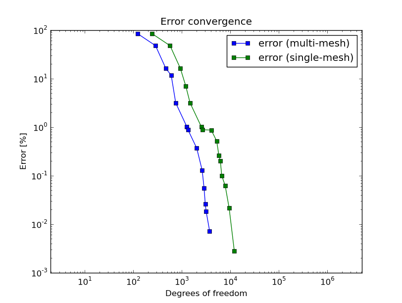
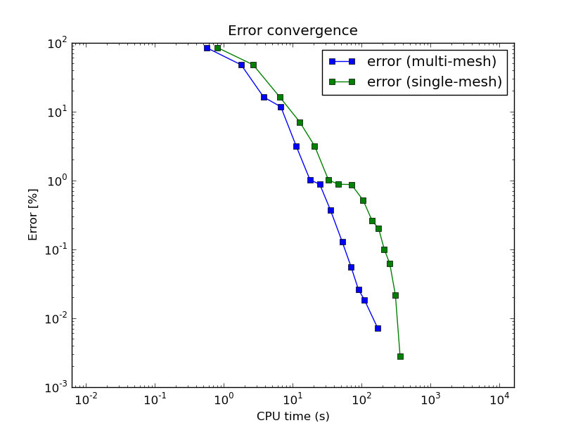

========
Tutorial
========

This tutorial should give you a good idea of how to adjust existing Hermes2D examples and create your own applications. 

Creating Mesh
-------------

Every finite element computation starts with partitioning the domain
into a finite element mesh. Hermes uses triangles and quadrilaterals, and 
can combine both element types in one mesh. While complicated meshes need 
to be constructed using specialized mesh generation software, in many cases 
we only need a simple initial mesh that can be created by hand. In Hermes, all you 
need to do is partition the domain very coarsely into several large elements,
and the adaptivity will take care of the rest. 

.. image:: img/simplemesh.png
   :align: center
   :width: 400
   :height: 400
   :alt: Sample finite element mesh.

The `source file <http://hpfem.org/git/gitweb.cgi/hermes2d.git/blob/HEAD:/tutorial/01-mesh/domain.mesh>`_ 
for this mesh is part of the tutorial example 
`01-mesh <http://hpfem.org/git/gitweb.cgi/hermes2d.git/tree/HEAD:/tutorial/01-mesh>`_. 
The domain is defined via four macroelements -- two
quadrilaterals and two curvilinear triangles. The elements are enumerated from 0 to 3. 
One also needs to enumerate all mesh vertices and assign markers to all boundary edges. 
Boundary markers are used to link boundary conditions with the boundary edges. 

Mesh File Format
~~~~~~~~~~~~~~~~

Hermes can read meshes in its own generic format as well as in the
`ExodusII <http://sourceforge.net/projects/exodusii/>`_ format
(this is, for example, the output of `Cubit <http://cubit.sandia.gov/>`_).
First let us discuss the generic Hermes mesh data format. Reading
of ExodusII mesh files is very simple as we will see in example "iron-water". 

Generic Hermes mesh file consists of variable assignments. Each variable can hold a real number, 
list of real numbers, or list of lists. The following are all valid definitions in 
the Hermes mesh file format::

    # comments start with a hash
    var = 5.0 + cos(pi)  # number
    list = { 1, 2, 3, 4, var }  # list
    pairs = { {1, 2}, {1, var}, {0, list} }  # list of lists

Every mesh file must contain at least the variables ``vertices``, ``elements``
and ``boundaries``. The variable ``vertices`` defines the coordinates
of all mesh vertices (in any order). In our case it looks like this::

    a = 1.0  # size of the mesh
    b = sqrt(2)/2

    vertices =
    {
      { 0, -a },    # vertex 0
      { a, -a },    # vertex 1
      { -a, 0 },    # vertex 2
      { 0, 0 },     # vertex 3
      { a, 0 },     # vertex 4
      { -a, a },    # vertex 5
      { 0, a },     # vertex 6
      { a*b, a*b }  # vertex 7
    }

The variable ``elements`` defines all elements in the mesh via zero-based indices of their vertices in counter-clockwise order, plus an extra number denoting the element (material) marker. Element markers allow you to use different material parameters in areas with different material parameters. Moreover, Hermes allows you to assign different weak formulations to those areas, which can be very useful for some types of multiphysics problems. If the domain is composed of only one material, as in our case, all elements may be assigned a zero marker:
::

    elements =
    {
      { 0, 1, 4, 3, 0 },  # quad 0
      { 3, 4, 7, 0 },     # tri 1
      { 3, 7, 6, 0 },     # tri 2
      { 2, 3, 6, 5, 0 }   # quad 3
    }

The last mandatory variable, ``boundaries``, defines boundary markers for all
boundary edges. By default, all edges have zero markers. Only those with
positive markers are considered to be part of the domain boundary and can be
assigned a boundary condition, as we will see later. An edge is identified by
two vertex indices. In our case, we have
::

    boundaries =
    {
      { 0, 1, 1 },
      { 1, 4, 2 },
      { 3, 0, 4 },
      { 4, 7, 2 },
      { 7, 6, 2 },
      { 2, 3, 4 },
      { 6, 5, 2 },
      { 5, 2, 3 }
    }

Finally, the file can also include the variable ``curves``, which lists all
curved edges.  Each curved edge is described by one NURBS curve, defined by its
degree, control points and knot vector. Simplified syntax is available for
circular arcs.

NURBS Curves
~~~~~~~~~~~~

Every NURBS curve is defined by its degree, control points with weights and the
knot vector. The degree $d$ is a positive integer, usually 1, 2, 3 or 5. Lines
and polylines are of degree 1, circles have degree 2 and free-form curves are
of degree 3 or 5. The control points $p_i$, $i = 0 \ldots n$, are the main tool for changing the
shape of the curve. A curve of degree $d$ must have at least $d+1$ control
points. In Hermes, the endpoints of the edge are always assumed to be the
first and last control points and therefore only the inner control points are
listed in the mesh file. There is a weight $w_i \geq 0$ for every control point,
that influences the shape of the curve in its vicinity. If $w_i = 0$ then 
$p_i$ has no effect on the shape.  As $w_i$ increases, the curve is pulled 
towards $p_i$.

The knot vector is a sequence of $m+1$ values that determines how much and
where the control points influence the shape. The relation $m = n+d+1$ must
hold. The sequence is nondecreasing, $t_i \leq t_{i+1}$, and divides the whole
interval $[0,1]$ into smaller intervals which determine the area of influence
of the control points. Since the curve has to start and end at the edge
vertices, the knot vector in Hermes always starts with $d+1$ zeros and ends
with $d+1$ ones. Only the inner knots are listed in the above definition of the
variable ``curves``, where $knots$ is a simple list of real values. For the 
above example, we have
::

    curves =
    {
      { 4, 7, 45 },  # +45 degree circular arcs
      { 7, 6, 45 }
    }
    # EOF

Loading Mesh
------------

As a ''Hello world'' example, let us load the mesh we have just created, and display it in a window. 
The  
`main.cpp <http://hpfem.org/git/gitweb.cgi/hermes2d.git/blob/HEAD:/tutorial/01-mesh/main.cpp>`_ file
that we are going to discuss is part of the tutorial example 
`01-mesh <http://hpfem.org/git/gitweb.cgi/hermes2d.git/tree/HEAD:/tutorial/01-mesh>`_. 
Every main.cpp file in the git repo contains lots of comments and instructions. Skipping those, 
the `main.cpp <http://hpfem.org/git/gitweb.cgi/hermes2d.git/blob/HEAD:/tutorial/01-mesh/main.cpp>`_ 
file begins with creating an instance of the class Mesh. In order to load
the mesh file, you have to create a mesh loader class (in our case that is ``H2DReader``) and
call the method ``load()``:
::

    #include "hermes2d.h"

    int main(int argc, char* argv[])
    {
      // load the mesh file
      Mesh mesh;
      H2DReader mloader;
      mloader.load("domain.mesh", &mesh);

Note: To load the exodus-II mesh file, one has to use ``ExodusIIReader`` class instead.

The following portion of code illustrates various types of initial mesh refinements.
It does not matter if the mesh becomes irregular, in fact, arbitrarily irregular
meshes are at the heart of Hermes: 
::

      // perform some sample initial refinements
      mesh.refine_all_elements();          // refines all elements
      mesh.refine_towards_vertex(3, 4);    // refines mesh towards
                                           // vertex #3 (4x)
      mesh.refine_towards_boundary(2, 4);  // refines all elements
                                           // along boundary 2 (4x)
      mesh.refine_element(86, 0);          // refines element #86
                                           // isotropically
      mesh.refine_element(112, 0);         // refines element #112
                                           // isotropically
      mesh.refine_element(84, 2);          // refines element #84
                                           // anisotropically
      mesh.refine_element(114, 1);         // refines element #114
                                           // anisotropically

Other ways of modifying meshes on the fly include
::

    Mesh::refine_element(int id, int refinement = 0)
    Mesh::refine_by_criterion(int (*criterion)(Element* e), int depth)
    Mesh::refine_towards_vertex(int vertex_id, int depth)
    Mesh::regularize(int n)
    Mesh::unrefine_element(int id)
    Mesh::unrefine_all_elements()

See the file `mesh.cpp <http://hpfem.org/git/gitweb.cgi/hermes2d.git/blob/HEAD:/src/mesh.cpp>`_ for details. 
The following code illustrates how to visualize the mesh using the class MeshView:
::

    // display the mesh
    // (100, 100) is the upper left corner position
    // 500 x 500 is the window size
    MeshView mview("Hello world!", 100, 100, 500, 500);
    mview.show(&mesh);

You can initialize it by supplying the title of the window and its initial position and size (all of these
parameters are optional). The class MeshView provides the method show() that displays a window showing the mesh:

.. image:: img/meshview2.png
   :align: center
   :width: 400
   :height: 400
   :alt: Image of the mesh created via the MeshView class.

Every main.cpp file is finished with 
::

    // wait for keyboard or mouse input
    View::wait("optional message.");
    return 0;
  }

so that you have a chance to see the graphical output.

Setting Up Space
----------------

Hermes follows the mathematical concept of FEM closely -- 
in the next step you need to construct a finite element space on top of the mesh.
The following predefined spaces are currently available:

* H1Space - the most common space of continuous, piecewise-polynomial functions belonging to $H^1(\Omega) = \{ v \in L^2(\Omega); \nabla u \in [L^2(\Omega)]^2 \}$,
* HcurlSpace - the space of vector-valued functions discontinuous along mesh edges, with continuous tangential component on the edges $H(\mbox{curl},\Omega) = \{ E \in [L^2(\Omega)]^2; \nabla \times E \in L^2(\Omega)\}$,
* HdivSpace - the space of vector-valued functions discontinuous along mesh edges, with continuous normal component on the edges $H(\mbox{div},\Omega) = \{ v \in [L^2(\Omega)^2; \nabla \cdot v \in L^2(\Omega)\}$,
* L2Space -  the space of functions discontinuous along mesh edges, belonging to the space $L^2(\Omega)$.

All these spaces allow for higher-order elements and meshes with arbitrary-level hanging nodes.
If you are not familiar with higher-order FEM, let us just say that the spaces can contain
quadratic, cubic, etc., *edge functions* that generate higher-degree
polynomials along mesh edges, and *bubble functions* that complete the higher-order
approximation in element interiors. Edge functions are associated with mesh edges,
and bubble functions with element interiors. The next figure shows a patch consisting of two triangular elements. An edge function is shown on the left, and a bubble function on one of the triangles on the right:

.. image:: img/basisfn.jpg
   :align: center
   :width: 600
   :height: 200
   :alt: Fourth-order edge function  (left) and one of the fifth-order bubble functions (right).

There are many possible ways of defining the
higher-order basis functions. A particular set of polynomials is called
*shapeset*. Using good shapeset is crucial for the
performance of the *hp*-FEM. No shapeset can be optimal for all possible operators.
Therefore, Hermes offers several shapesets from which
you need to choose one when creating a FE space. The ones which perform best
in most computations (according to our experience) are simply called
H1Shapeset, HcurlShapeset, HdivShapeset and L2Shapeset.
Others can be found in the files src/shapeset* in the Hermes git repo.
Any shapeset can be used for more than one space.

We are now ready for an example. The following code snippets come from
the `main.cpp <http://hpfem.org/git/gitweb.cgi/hermes2d.git/blob/HEAD:/tutorial/02-space/main.cpp>`_ file 
in the tutorial example `02-space <http://hpfem.org/git/gitweb.cgi/hermes2d.git/tree/HEAD:/tutorial/02-space>`_. 
We assume that a mesh has already
been loaded. First we create an instance of H1Shapeset and then an
instance of H1Space, supplying the mesh and shapeset pointers:
::

    // create a shapeset and an H1 space
    H1Shapeset shapeset;
    H1Space space(&mesh, &shapeset);

When the space is created, we need to initialize the polynomial
degrees of all elements. (The words *degree* and *order* have the same meaning for us.)
This can be done for individual elements by calling the method
Space::set_element_order(), or for all elements at once using
Space::set_uniform_order(). It is important to note that element degrees
are stored in Space, not in Mesh. The reason is that you can
have multiple different spaces with different element degrees and even types 
over the same mesh. In Hermes, Mesh only stores geometrical information.
::

    // assign element orders and initialize the space
    space.set_uniform_order(P_INIT);
    // enumerate basis functions
    space.assign_dofs();

A space created in this way is ready for use. By default, it is equipped with
zero Neumann boundary conditions on the entire domain boundary. Later we will see
how to change that.

As a debugging/learning feature, Hermes enables visualization of all basis functions 
in a Space. Similarly to MeshView, you can create a BaseView object and use it 
to display the entire basis (VectorBaseView has to be used for vector-valued 
approximations in spaces Hcurl and Hdiv - this will be discussed later). 
You can cycle through all basis functions in the window using the arrow keys. 
If you press the left mouse button at the beginning, you will see the Dirichlet 
lift (a function that represents Dirichlet boundary conditions).
::

    // view the basis functions
    BaseView bview;
    bview.show(&space);

This is how the last figure above was obtained (press the '3' key for 3D mode).
We suggest that you spend some time experimenting with element refinements and 
hanging nodes to see how basis functions on irregular meshes look like.

Solving Poisson Equation
------------------------

Let us solve the Poisson equation

.. math::
    :label: poisson1

       -\Delta u = CONST_F

on the L-shaped domain $\Omega$ from the previous example,
equipped with a homogeneous Dirichlet boundary condition

.. math::
    :label: poisson2

       u = 0\ \ \  \mbox{on}\  \partial \Omega,

where $CONST_F$ is a real number. The weak formulation 
is derived in the standard way, first by multiplying equation :eq:`poisson1` with a test
function $v$, then integrating over the domain $\Omega$, and then applying the Green's
theorem (integration by parts) to the second derivatives.
Because of the homogeneous Dirichlet condition :eq:`poisson2`,
the proper space for the solution is $V = H^1_0(\Omega)$. The weak formulation reads:
Find $u \in V$ such that

.. math::
    :label: poissonweak

         \int_\Omega \nabla u \cdot \nabla v \;\mbox{d\bfx} = CONST_F \int_\Omega v \;\mbox{d\bfx} \ \ \ \mbox{for all}\ v \in V.

Equation :eq:`poissonweak` has the standard form $a(u,v) = l(v)$ and thus in Hermes
we need a way to specify the bilinear form $a(u,v)$ and the linear form $l(v)$.
In the code this is done by implementing the following two functions:
::

    template<typename Real, typename Scalar>
    Scalar bilinear_form(int n, double *wt, Func<Real> *u, Func<Real> *v, Geom<Real> *e, ExtData<Scalar> *ext);

    template<typename Real, typename Scalar>
    Scalar linear_form(int n, double *wt, Func<Real> *v, Geom<Real> *e, ExtData<Scalar> *ext);

These functions will be called for each element during the stiffness matrix
assembly and must return the values of the bilinear and linear forms for the given arguments.
RealFunction represents one of the basis functions restricted to the
current element and RefMap represents the reference mapping of the current element.
There are methods for extracting the values of the basis functions at integration points,
which allows you to evaluate the integrals by yourself, but this is normally not needed,
since many common weak forms have already been implemented.
In this case, we can simply use the predefined functions
int_grad_u_grad_v and int_v:
::

    // return the value \int \nabla u . \nabla v dx
    template<typename Real, typename Scalar>
    Scalar bilinear_form(int n, double *wt, Func<Real> *u, Func<Real> *v, Geom<Real> *e, ExtData<Scalar> *ext)
    {
      return int_grad_u_grad_v<Real, Scalar>(n, wt, u, v);
    }
   
    // return the value \int v dx
    template<typename Real, typename Scalar>
    Scalar linear_form(int n, double *wt, Func<Real> *v, Geom<Real> *e, ExtData<Scalar> *ext)
    {
      return CONST_F * int_v<Real, Scalar>(n, wt, v);
    }

We can now state our problem in the following way
(see the `main.cpp <http://hpfem.org/git/gitweb.cgi/hermes2d.git/blob/HEAD:/tutorial/03-poisson/main.cpp>`_ 
file in the tutorial example `03-poisson <http://hpfem.org/git/gitweb.cgi/hermes2d.git/tree/HEAD:/tutorial/03-poisson>`_):
::

    // initialize the weak formulation
    WeakForm wf(1);
    wf.add_biform(0, 0, callback(bilinear_form));
    wf.add_liform(0, callback(linear_form));

The class WeakForm represents the weak formulation of the PDE and must be
initialized with the number of equations in the system, in our case one. We then
supply the class pointers to our bilinear and linear form functions. If the PDE
was more complicated, we could add multiple bilinear and/or linear forms.

Given the weak formulation and the discretization determined by the space and its mesh,
we can proceed to the approximate solution of the problem by the Galerkin method.
This method is the core of Hermes and provides a way to obtain a sparse linear
system of equations, represented by the class LinSystem in the code. The solution
of the linear system then yields an approximate solution of the original problem.

The class LinSystem needs three things: your weak formulation, your spaces and
finally an external sparse matrix solver, for example CG or UMFPACK. The following lines
create the linear solver, initialize the LinSystem class and pass a pointer to
the H1Space we have created in the previous section.
::

    // initialize the linear system and solver
    UmfpackSolver umfpack;
    LinSystem sys(&wf, &umfpack);
    sys.set_spaces(1, &space);
    sys.set_pss(1, &pss);

The last line must be included for historical reasons. During matrix assembly,
Hermes caches the values of all shape function polynomials for better performance.
The cache is represented by the class PrecalcShapeset and you have to
include the following line at the beginning of your program:
::

    PrecalcShapeset pss(&shapeset);

Finally, we tell LinSystem to assemble the stiffness matrix and the right-hand
side and solve the resulting linear system: 
::

    // assemble the stiffness matrix and solve the system
    Solution sln;
    sys.assemble();
    sys.solve(1, &sln);

For the Poisson problem, we are finished. The last two lines can be repeated many 
times in time-dependent problems. The instance of the class Solution, upon the
completion of LinSystem::solve(), contains the approximate solution of
the PDE. You can ask for its values or you can visualize the solution immediately 
using the ScalarView class:
::

    // visualize the solution
    ScalarView view("Solution");
    view.show(&sln);

For the complete source code we refer to the 
`main.cpp <http://hpfem.org/git/gitweb.cgi/hermes2d.git/blob/HEAD:/tutorial/03-poisson/main.cpp>`_ file
in the tutorial example '03-poisson <http://hpfem.org/git/gitweb.cgi/hermes2d.git/tree/HEAD:/tutorial/03-poisson>'_.
The following figure shows the output.

.. image:: img/poisson.png
   :align: center
   :width: 400
   :height: 350
   :alt: Solution of the Poisson equation.

Numerical Integration
---------------------

You may wonder why templates are used in the definition of weak forms. As a matter of fact, 
they do not have to be, as we will see later. However, if the weak form only contains 
algebraic operations (without if-then statements and such), templates help to determine
numerical integration orders automatically. In higher-order FEM, basis and test functions may 
have very different polynomial degrees, ranging from one and some maximum polynomial 
degree (currently 10 in Hermes). The basis and test functions can be combined inside the 
weak forms in many different ways. As a result, the minimum quadrature order which is needed 
to evaluate a weak form accurately may vary a lot - between zero (product of gradients of 
two linear functions) to infinity (whenever a nonpolynomial expression is present). 
Numerical quadrature is one of the trickiest issues in higher-order FEM.

Of course, a brute-force solution to this problem would be to integrate everything using 
a maximum order, but this would lead to tremendous computing times. Therefore Hermes offers 
two options: the polynomial degree of the integrated expressions can be detected 
automatically (the templates). Or, the user can define for each weak form the resulting 
polynomial degree explicitly. If the weak form only contains polynomial expressions, the former
approach works very well. If the form is more complicated, it is recommended to handle the
integration orders explicitly. This will be described in detail in example 07-general later.
Till then, we will use the automated way.

Boundary Conditions
-------------------

Hermes recognizes two basic types of boundary conditions: *essential* and *natural*.
Essential boundary conditions influence the finite element space while natural
conditions do not (they are incorporated into boundary integrals in the weak formulation).
In the context of elliptic problems, Dirichlet conditions are essential and Neumann/Newton
conditions are natural.

Dirichlet BC
~~~~~~~~~~~~

Since essential conditions restrict degrees of freedom (DOF) in the FE space, 
they need to be incorporated while the space is set up.
The user has to provide the following two callback functions:
::

    int bc_types(int marker);
    scalar bc_values(int marker, double x, double y);

The first one, given the boundary marker number, determines the type of BC which the associated
portion of the domain boundary belongs to, by returning one of the predefined constants 
BC_ESSENTIAL or BC_NATURAL. The second callback needs to return the boundary value for a given marker
and position on the boundary (only needed for essential boundary condition markers - for natural
boundary conditions this value is ignored).
The space initialization can then look as follows:
::

    H1Space space(&mesh, &shapeset);
    space.set_bc_types(bc_types);
    space.set_bc_values(bc_values);

Suppose we would like to modify the previous Poisson model problem in the following way:

.. math::
         -\Delta u = CONST_F,\ u(x,y) = -\frac{CONST_F}{4}(x^2 + y^2)\,\ \mbox{on}\,\ \partial \Omega.

Besides changing the linear form, we need to specify that all the boundary markers 1, 2, 3, 4
denote the essential boundary condition:
::

    int bc_types(int marker)
    {
      return BC_ESSENTIAL;
    }

Further, the value callback must return the value of the Dirichlet BC:
::

    scalar bc_values(int marker, double x, double y)
    {
      return (-CONST_F/4)*(x*x + y*y);
    }

See the `main.cpp <http://hpfem.org/git/gitweb.cgi/hermes2d.git/blob/HEAD:/tutorial/04-bc-dirichlet/main.cpp>`_ 
file in the tutorial example `04-bc-dirichlet <http://hpfem.org/git/gitweb.cgi/hermes2d.git/tree/HEAD:/tutorial/04-dirichlet>`_. 
It is easy to see that the solution to this problem is the function

.. math::
         u(x,y) = -\frac{CONST_F}{4}(x^2 + y^2). 

For the value $CONST_F = -4$, the output is shown below:

.. image:: img/dirichlet.png
   :align: center
   :width: 400
   :height: 350
   :alt: Solution of the Dirichlet problem.

Neumann BC
~~~~~~~~~~

Next, let us consider Neumann boundary conditions. The new model problem
will have the form

.. math::
    :nowrap:

    \begin{eqnarray*}   -\Delta u = CONST_F,\ \ \ \ \ &&u = 0\,\ \mbox{on}\,\ \Gamma_4,\\                            &&\dd{u}{n} = C_1\,\ \mbox{on}\,\ \Gamma_1,\\                            &&\dd{u}{n} = C_2\,\ \mbox{on}\,\ \Gamma_2,\\                            &&\dd{u}{n} = C_3\,\ \mbox{on}\,\ \Gamma_3. \end{eqnarray*}

where $\Gamma_1 \dots \Gamma_4$ correspond to the edges marked $1 \dots 4$. Now, the weak formulation contains some surface integrals:

.. math::

    \int_\Omega \nabla u \cdot \nabla v \;\mbox{d\bfx} =   CONST_F\int_\Omega v \;\mbox{d\bfx}   + C_1\int_{\Gamma_1} \!v \;\mbox{d}l   + C_2\int_{\Gamma_2} \!v \;\mbox{d}l   + C_3\int_{\Gamma_3} \!v \;\mbox{d}l

In Hermes, all forms in the standard weak formulation $a(u,v) = l(v)$
are in fact defined as a sum of contributions from volume integrals and from
surface integrals. In the case of the linear form $l(v)$, this means

.. math::

    l(v) = \sum_m l_m^{\,\rm vol}(v) + \sum_n l_n^{\,\rm surf}(v).

We have already seen volumetric linear forms in example 03-poisson. 
Surface linear forms are implemented similarly. Our new right-hand side will
be represented by two functions with the following prototypes:
::

    template<typename Real, typename Scalar>
    Scalar linear_form(int n, double *wt, Func<Real> *v, Geom<Real> *e, ExtData<Scalar> *ext)
    
    template<typename Real, typename Scalar>
    Scalar linear_form_surf(int n, double *wt, Func<Real> *v, Geom<Real> *e, ExtData<Scalar> *ext);

and will be added to the WeakForm by the following code (see the 
`main.cpp <http://hpfem.org/git/gitweb.cgi/hermes2d.git/blob/HEAD:/tutorial/05-bc-neumann/main.cpp>`_ file 
of the tutorial example `05-bc-neumann <http://hpfem.org/git/gitweb.cgi/hermes2d.git/tree/HEAD:/tutorial/05-bc-neumann>`_):
::

    // initialize the weak formulation
    WeakForm wf(1);
    wf.add_biform(0, 0, callback(bilinear_form));
    wf.add_liform(0, callback(linear_form));
    wf.add_liform_surf(0, callback(linear_form_surf));

The surface linear form is defined as follows:
::

    template<typename Real, typename Scalar>
    Scalar linear_form_surf(int n, double *wt, Func<Real> *v, Geom<Real> *e, ExtData<Scalar> *ext)
    {
      return CONST_GAMMA[e->marker - 1] * int_v<Real, Scalar>(n, wt, v);
    }

Here, we have used the predefined surface integral surf_int_v (see the
file `src/integrals_h1.h <http://hpfem.org/git/gitweb.cgi/hermes2d.git/blob/HEAD:/src/integrals_h1.h>`_). If the boundary conditions were more complicated, we could also
have used surf_int_F_v, where F stands for an arbitrary user-supplied
function returning the value $\partial u/\partial n$.

Refer to the `main.cpp <http://hpfem.org/git/gitweb.cgi/hermes2d.git/blob/HEAD:/tutorial/05-bc-neumann/main.cpp>`_ file 
of the tutorial example `05-bc-neumann <http://hpfem.org/git/gitweb.cgi/hermes2d.git/tree/HEAD:/tutorial/05-bc-neumann>`_ 
for the complete code. Note that the mesh is refined towards the re-entrant corner in order to 
capture the singular gradient.
::

    // load the mesh file
    Mesh mesh;
    H2DReader mloader;
    mloader.load("domain.mesh", &mesh);
    mesh.refine_towards_vertex(3, CORNER_REF_LEVEL);

The gradient magnitude can be visualized via a MagFilter:
::

    // compute and show gradient magnitude
    // (note that the infinite gradient at the re-entrant
    // corner will be truncated for visualization purposes)
    ScalarView gradview("Gradient", 650, 0, 600, 600);
    MagFilter grad(&sln, &sln, FN_DX, FN_DY);
    gradview.show(&grad);

The approximate solution for the values $C_1 = -1/2$, $C_2 = 1$, $C_3 = -1/2$,
along with the singularity of gradient at the re-entrant corner are
shown in the following figures:

.. image:: img/neumann2.png
   :align: left
   :width: 530
   :height: 400
   :alt: Solution of the Neumann problem.

.. image:: img/neumann3.png
   :align: right
   :width: 400
   :height: 400
   :alt: Detail of gradient singularity at the re-entrant corner.

.. raw:: html

   

Newton BC
~~~~~~~~~

Another common natural boundary condition is the Newton (sometimes called Robin) condition
of the form

.. math::

    \dd{u}{n} + c_1 u = c_2, \ \ \ \ c_1 \ne 0.

Analogously to Neumann conditions, also Newton conditions yield surface integrals. However,
this time they are both in the bilinear form and in the linear form,
The bilinear form is
a sum of volume and surface forms that can be added to the weak formulation using the methods
add_biform() and add_biform_surf(). 
The surface bilinear form must have the following prototype:
::

    template<typename Real, typename Scalar>
    Scalar bilinear_form_surf(int n, double *wt, Func<Real> *u, Func<Real> *v, Geom<Real> *e, ExtData<Scalar> *ext);

Inside this function you can use predefined
forms such as surf_int_u_v, surf_int_F_u_v (see the
file `src/integrals_h1.h <http://hpfem.org/git/gitweb.cgi/hermes2d.git/blob/HEAD:/src/integrals_h1.h>`_) or your custom forms.

Example 06-bc-newton demonstrates typical usage of the Newton
boundary condition on a stationary heat transfer problem, where one part of the boundary
represents a heat exchange surface obeying the Newton law of cooling.
The following code snippet contains the linear and bilinear forms:
::

    template<typename Real, typename Scalar>
    Scalar bilinear_form(int n, double *wt, Func<Real> *u, Func<Real> *v, Geom<Real> *e, ExtData<Scalar> *ext)
    {
      return int_grad_u_grad_v<Real, Scalar>(n, wt, u, v);
    }

    template<typename Real, typename Scalar>
    Scalar bilinear_form_surf(int n, double *wt, Func<Real> *u, Func<Real> *v, Geom<Real> *e, ExtData<Scalar> *ext)
    {
      return H * int_u_v<Real, Scalar>(n, wt, u, v);
    }

    template<typename Real, typename Scalar>
    Scalar linear_form_surf(int n, double *wt, Func<Real> *v, Geom<Real> *e, ExtData<Scalar> *ext)
    {
      return T0 * H * int_v<Real, Scalar>(n, wt, v);
    }

  

Here, $T_0$ is the exterior temperature, and $H$ is the heat flux.
The above forms are registered using
::

    WeakForm wf(1);
    wf.add_biform(0, 0, callback(bilinear_form));
    wf.add_biform_surf(0, 0, callback(bilinear_form_surf), 1);
    wf.add_liform_surf(0, callback(linear_form_surf), 1);

The last parameter in add_biform_surf() and add_liform_surf() is the boundary marker of the 
Newton boundary. The following figures show the solution and singularity of gradient 
at the re-entrant corner:

.. image:: img/newton1.png
   :align: left
   :width: 530
   :height: 400
   :alt: Solution of the Newton problem.

.. image:: img/newton2.png
   :align: right
   :width: 400
   :height: 400
   :alt: Detail of gradient singularity at the re-entrant corner.

.. raw:: html

   

General 2nd-Order Linear Equation
---------------------------------

This example deals with a linear second-order equation of the form 

.. math::

         -\frac{\partial}{\partial x}\left(a_{11}(x,y)\frac{\partial u}{\partial x}\right) - \frac{\partial}{\partial x}\left(a_{12}(x,y)\frac{\partial u}{\partial y}\right) - \frac{\partial}{\partial y}\left(a_{21}(x,y)\frac{\partial u}{\partial x}\right) - \frac{\partial}{\partial y}\left(a_{22}(x,y)\frac{\partial u}{\partial y}\right) + a_1(x,y)\frac{\partial u}{\partial x} + a_{21}(x,y)\frac{\partial u}{\partial y} + a_0(x,y)u = rhs(x,y),

equipped with Dirichlet and/or Neumann boundary conditions. It has two goals: (a) to show the way one defines and uses space-dependent coefficients, and (b) to show how integration orders in weak forms can be handled explicitly. The code can be found in the `main.cpp <http://hpfem.org/git/gitweb.cgi/hermes2d.git/blob/HEAD:/tutorial/07-general/main.cpp>`_ file of the 
tutorial example `07-general <http://hpfem.org/git/gitweb.cgi/hermes2d.git/tree/HEAD:/tutorial/07-general>`_.

First we define the (generally) non-constant equation coefficients:
::

    double a_11(double x, double y) {
      if (y > 0) return 1 + x*x + y*y;
      else return 1;
    }

and so on. Then we define boundary conditions as usual. The weak formulation contains
both volumetric and surface integrals. 

The Ord class in Hermes (see the file `forms.h 
<http://hpfem.org/git/gitweb.cgi/hermes2d.git/blob/HEAD:/src/forms.h>`_) provides
an automatic parser of weak forms that is able to determine the integration orders for 
algebraic expressions. So, in order to define an integration order explicitly, one can 
provide on top the weak form another function that defines a simple algebraic expression 
that leads the parser to the desired polynomial degree. The values defined in this  
additional function are not used for computation. 

::

    // (Volumetric) bilinear form
    template<typename Real, typename Scalar>
    Scalar bilinear_form(int n, double *wt, Func<Real> *u, Func<Real> *v, Geom<Real> *e, ExtData<Scalar> *ext)
    {
      Scalar result = 0;
      for (int i=0; i < n; i++) {
        double x = e->x[i];
        double y = e->y[i];
        result += (a_11(x, y)*u->dx[i]*v->dx[i] + 
                   a_12(x, y)*u->dy[i]*v->dx[i] +
                   a_21(x, y)*u->dx[i]*v->dy[i] +
                   a_22(x, y)*u->dy[i]*v->dy[i] +
                   a_1(x, y)*u->dx[i]*v->val[i] +
                   a_2(x, y)*u->dy[i]*v->val[i] +
                   a_0(x, y)*u->val[i]*v->val[i]) * wt[i];
      }
      return result;
    }

    // Integration order for the bilinear form
    Ord bilinear_form_ord(int n, double *wt, Func<Ord> *u, 
                      Func<Ord> *v, Geom<Ord> *e, ExtData<Ord> *ext)
    {
      return u->val[0] * v->val[0] * x * x; // returning the sum of the degrees of the basis 
                                            // and test function plus two
    }

    // Surface linear form (natural boundary conditions)
    template<typename Real, typename Scalar>
    Scalar linear_form_surf(int n, double *wt, Func<Real> *v, Geom<Real> *e, ExtData<Scalar> *ext)
    {
      return int_F_v<Real, Scalar>(n, wt, g_N, v, e);
    }
  
    // Integration order for surface linear form
    Ord linear_form_surf_ord(int n, double *wt, Func<Ord> *v, Geom<Ord> *e, ExtData<Ord> *ext)
    {
      return v->val[0] * x * x;  // returning the polynomial degree of the test function plus two
    }
  
    // Volumetric linear form (right-hand side)
    template<typename Real, typename Scalar>
    Scalar linear_form(int n, double *wt, Func<Real> *v, Geom<Real> *e, ExtData<Scalar> *ext)
    {
      return int_F_v<Real, Scalar>(n, wt, rhs, v, e);
    }
  
    // Integration order for the volumetric linear form
    Ord linear_form_ord(int n, double *wt, Func<Ord> *v, Geom<Ord> *e, ExtData<Ord> *ext)
    {
      return v->val[0] * x * x;  // returning the polynomial degree of the test function plus two
    }

The polynomial degree of basis and test functions also can be accessed directly as follows:

::

    Ord bilinear_form_ord(int n, double *wt, Func<Ord> *u, 
                          Func<Ord> *v, Geom<Ord> *e, ExtData<Ord> *ext)
    {
      int uo = u->val[0].get_order();
      int vo = v->val[0].get_order();
      return Ord(uo + vo);
    }

Note that in principle it is also possible to return a constant order (for example 5) by using 

::

    Ord bilinear_form_ord(int n, double *wt, Func<Ord> *u, 
                      Func<Ord> *v, Geom<Ord> *e, ExtData<Ord> *ext)
    {
      return Ord(5);
    }

Currently, one cannot make the integration order dependent on spatial coordinates and such. However,
one can assign different weak forms to elements with different material flags. This will be 
described in example `saphir <http://hpfem.org/git/gitweb.cgi/hermes2d.git/blob/HEAD:/examples/saphir/main.cpp>`_.

Also note the sign of the surface linear form - all linear forms have to be on the right-hand side,
all bilinear forms on the left. 

The output of this example is shown below:

.. image:: img/general.png
   :align: center
   :width: 500
   :height: 400
   :alt: Output of example 07-general.

Systems of Equations
--------------------

So far we always have solved a single linear PDE with the weak formulation
of the form $a(u,v) = l(v)$, where $u, v$ were continuous approximations in the
$H^1$ space. Analogously one can handle single equations whose solutions lie in the spaces
$Hcurl$, $Hdiv$ or $L^2$.

However, Hermes also can handle a system of $n$ linear PDEs, provided that the weak formulation 
can be written as

.. math::
    :label: weaksystem

      a_{11}(u_1,v_1)\,+ a_{12}(u_2,v_1)\,+ \cdots\,+ a_{1n}(u_n,v_1) = l_1(v_1),

      a_{21}(u_1,v_2)\,+ a_{22}(u_2,v_2)\,+ \cdots\,+ a_{2n}(u_n,v_2) = l_2(v_2),

                                                          \vdots

      a_{n1}(u_1,v_n) + a_{n2}(u_2,v_n) + \cdots + a_{nn}(u_n,v_n) = l_n(v_n).

The solution $u = (u_1, u_2, \dots, u_n)$ and test functions $v =
(v_1, v_2, \dots, v_n)$ belong to the space $W = V_1 \times V_2 \times \dots
\times V_n$, where each $V_i$ is one of the available function spaces.

Let us illustrate this by solving a simple problem of linear elasticity. Consider a
two-dimensional elastic body shown in the following figure (the bottom edge is
axis of planar symmetry):

.. image:: img/elastsample.png
   :align: center
   :width: 500
   :height: 300
   :alt: Geometry and boundary conditions.

In the plane-strain model of linear elasticity the goal is to determine the
deformation of the body subject to the forces $f$. The deformation is sought
as a vector function $u(x) = (u_1, u_2)^T$, describing the displacement of each point
$x \in \Omega$ after the load $f = (f_1, f_2)^T$ is applied.

The boundary conditions are

.. math::
    :nowrap:

    \begin{eqnarray*}
    \frac{\partial u_1}{\partial n} &=& f_1 \ \text{on $\Gamma_3$,} \\
    \frac{\partial u_1}{\partial n} &=& 0 \ \text{on $\Gamma_2$, $\Gamma_4$, $\Gamma_5$,} \\
    \frac{\partial u_2}{\partial n} &=& f_2 \ \text{on $\Gamma_3$,} \\
    \frac{\partial u_2}{\partial n} &=& 0 \ \text{on $\Gamma_2$, $\Gamma_4$, $\Gamma_5$,} \\
    u_1 &=& u_2 = 0 \ \mbox{on} \ \Gamma_1. 
    \end{eqnarray*}

Applying the standard procedure to the elastostatic equilibrium equations, we arrive at the following weak formulation:

.. math::
    :nowrap:

    \begin{eqnarray*}   \int_\Omega     (2\mu\!+\!\lambda)\dd{u_1}{x_1}\dd{v_1}{x_1} + \mu\dd{u_1}{x_2}\dd{v_1}{x_2} +     \mu\dd{u_2}{x_1}\dd{v_1}{x_2} + \lambda\dd{u_2}{x_2}\dd{v_1}{x_1}     \,\mbox{d}\bfx \!\!&=&\!\!\!     \int_{\Gamma_3} \!\!f_1 v_1 \,\mbox{d}S, \\ \smallskip   \int_\Omega     \mu\dd{u_1}{x_2}\dd{v_2}{x_1} + \lambda\dd{u_1}{x_1}\dd{v_2}{x_2} +     (2\mu\!+\!\lambda)\dd{u_2}{x_2}\dd{v_2}{x_2} + \mu\dd{u_2}{x_1}\dd{v_2}{x_1}     \,\mbox{d}\bfx \!\!&=&\!\!\!     \int_{\Gamma_3} \!\!f_2 v_2 \,\mbox{d}S. \end{eqnarray*}

We see that the weak formulation can indeed be written in the form :eq:`weaksystem`:

.. math::
    :nowrap:

    \begin{eqnarray*}
      a_{11}(u_1, v_1) \!&=&\! \int_\Omega (2\mu+\lambda)\dd{u_1}{x_1}\dd{v_1}{x_1} + \mu\dd{u_1}{x_2}\dd{v_1}{x_2} \,\mbox{d}\bfx,  \\
      a_{12}(u_2, v_1) \!&=&\! \int_\Omega \mu\dd{u_2}{x_1}\dd{v_1}{x_2} + \lambda\dd{u_2}{x_2}\dd{v_1}{x_1} \,\mbox{d}\bfx,\\
      a_{21}(u_1, v_2) \!&=&\! \int_\Omega \mu\dd{u_1}{x_2}\dd{v_2}{x_1} + \lambda\dd{u_1}{x_1}\dd{v_2}{x_2} \,\mbox{d}\bfx,\\
      a_{22}(u_2, v_2) \!&=&\! \int_\Omega (2\mu+\lambda)\dd{u_2}{x_2}\dd{v_2}{x_2} + \mu\dd{u_2}{x_1}\dd{v_2}{x_1} \,\mbox{d}\bfx,  \\
      l_{1}(v_1) \!&=&\!
      \int_{\Gamma_3} \!\!f_1 v_1 \,\mbox{d}S, \\
      l_{2}(v_2) \!&=&\!
      \int_{\Gamma_3} \!\!f_2 v_2 \,\mbox{d}S.
    \end{eqnarray*}

Here, $\mu$ and $\lambda$ are material constants (Lame coefficients) defined as

.. math::

    \mu = \frac{E}{2(1+\nu)}, \ \ \ \ \  \lambda = \frac{E\nu}{(1+\nu)(1-2\nu)},

where $E$ is the Young modulus and $\nu$ the Poisson ratio of the material. For
steel, we have $E = 200$ GPa and $\nu = 0.3$. The load is $f = (0, 10^4)^T$ N.

For more details we refer to the mesh file `sample.mesh <http://hpfem.org/git/gitweb.cgi/hermes2d.git/blob/HEAD:/tutorial/08-system/sample.mesh>`_ as well as to the `main.cpp <http://hpfem.org/git/gitweb.cgi/hermes2d.git/blob/HEAD:/tutorial/08-system/main.cpp>`_ file of the tutorial example `08-system <http://hpfem.org/git/gitweb.cgi/hermes2d.git/tree/HEAD:/tutorial/08-system>`_. 

We will again start by defining the function spaces for the two solution
components, $u_1$ and $u_2$ (the $x$ and $y$ displacement). The boundary
conditions can be implemented as
::

    int bc_types(int marker)
      { return (marker == 1) ? BC_ESSENTIAL : BC_NATURAL;; }

    double bc_values(int marker, double x, double y)
      { return 0;}

Next we create the two displacement spaces, xdisp and ydisp:
::

    // create the x displacement space
    H1Space xdisp(&mesh, &shapeset);
    xdisp.set_bc_types(bc_types);
    xdisp.set_bc_values(bc_values);
    xdisp.set_uniform_order(P\_INIT);

    // create the y displacement space
    H1Space ydisp(&mesh, &shapeset);
    ydisp.set_bc_types(bc_types);
    ydisp.set_bc_values(bc_values);
    ydisp.set_uniform_order(P\_INIT);

Our WeakForm instance will be initialized for two equations in the system.
After implementing the weak forms using the predefined integrals
int_a_dudx_dvdx_b_dudy_dvdy and int_a_dudx_dvdy_b_dudy_dvdx,
we can add them to the weak formulation using add_biform().
The first two parameters of this method correspond to the position of the form
in the block weak form :eq:`weaksystem` with zero-based numbering. The 
surface linear form is treated analogously.
::

    // initialize the weak formulation
    WeakForm wf(2);
    wf.add_biform(0, 0, callback(bilinear_form_0_0), SYM);  // Note that only one symmetric part is
    wf.add_biform(0, 1, callback(bilinear_form_0_1), SYM);  // added in the case of symmetric bilinear
    wf.add_biform(1, 1, callback(bilinear_form_1_1), SYM);  // forms.
    wf.add_liform_surf(0, callback(linear_form_surf_0), 3);
    wf.add_liform_surf(1, callback(linear_form_surf_1), 3);

An explanation of the extra parameter SYM in add_biform() is in order.
Since the two diagonal forms $a_{11}$ and $a_{22}$ are symmetric, i.e.,
$a_{ii}(u,v) = a_{ii}(v,u)$, Hermes can be told to only evaluate them once for the
two cases $a_{ii}(u,v)$ and $a_{ii}(v,u)$ to speed up assembly. In fact, we should have
used the SYM flag already in the previous sections, since the form
$a(u,v) = \nabla u \cdot \nabla v$ is also symmetric. This is however not the case
for all forms and so the default value of the fourth parameter of add_biform() is UNSYM.

The off-diagonal forms $a_{12}(u_2, v_1)$ and $a_{21}(u_1, v_2)$ are not
(and cannot) be symmetric, since their arguments come from different spaces.
However, we can see that $a_{12}(u, v) = a_{21}(v, u)$, i.e., the corresponding blocks
of the local stiffness matrix are transposes of each other. Here, the SYM flag
has a different effect: it tells Hermes to take the block of the local stiffness
matrix corresponding to the form $a_{12}$, transpose it and copy it where a block
corresponding to $a_{21}$ would belong, without evaluating $a_{21}$ at all (this is why
we don't add bilinear_form_1_0). This again speeds up the matrix assembly.
You can also use the flag ANTISYM, which moreover inverts the sign of the block.
This makes sense in the case where $a_{ij}(u, v) = -a_{ji}(v, u)$.

It is recommended that you start with the default (and safe) UNSYM flag for all
forms when developing your project, and only optimize the evaluation of the forms when
the code works well.

With the WeakForm and spaces ready, we can initialize the linear system.
The only difference is that we now have two spaces determining the discretization
of the problem.
::

    LinSystem sys(&wf, &umfpack);
    sys.set_spaces(2, &xdisp, &ydisp);

All that is left is to assemble the stiffness matrix and solve the system.
Since we have two equations and two spaces, we receive two solutions, one for each
displacement component:
::

    Solution xsln, ysln;
    sys.assemble();
    sys.solve(2, &xsln, &ysln);

As in the previous sections, it is now possible to visualize the displacement
solutions, e.g.,
::

    ScalarView view("y displacement [m]");
    view.show(&ysln);

Usually, however, it is necessary to postprocess the solution in order to obtain more
informative visualization. In elasticity problems, one is often interested in material
stress, which is obtained by a formula combining the derivatives of the two displacements.
Hermes implements postprocessing through *filters*. A filter is a special class
which takes up to three Solutions, performs some computation and in the end acts
as another Solution, which can be visualized, or even fed into another filter.
Here, we can use the predefined filter VonMisesFilter, which calculates the
Von Mises stress:
::

    VonMisesFilter stress(&xsln, &ysln, mu, lambda);
    view.show(&stress, EPS_HIGH, 0);

The second parameter of show() is the visualization accuracy and can be
EPS_LOW, EPS_NORMAL (default) and EPS_HIGH. The third parameter is
the component number and is only valid for vector-valued ($Hcurl$) solutions.

Finally, in elasticity problems, it may be illustrative to distort the computational
domain according to the calculated displacement. The function View::show() can be
passed three more optional parameters, which represent the $x$ and $y$ displacement
and a multiplier to make the displacements visible.
::

    VonMisesFilter stress(&xsln, &ysln, mu, lambda);
    view.show(&stress, EPS_HIGH, 0, &xsln, &ysln, 1.5e5);

.. image:: img/mises.png
   :align: center
   :width: 550
   :height: 300
   :alt: Elastic stress plotted on deformed domain.

Transient Problems
------------------

This section describes the implementation of a simple time-dependent
heat transfer model that can be found in the tutorial example
`09-timedep <http://hpfem.org/git/gitweb.cgi/hermes2d.git/tree/HEAD:/tutorial/09-timedep>`_.
The model describes in a naive approximation how the St. Vitus cathedral
in Prague responds to changes in the surrounding air temperature
during one 24-hour cycle. The geometry is shown below:

.. image:: img/vitus1.png
   :align: center
   :width: 400
   :height: 500
   :alt: Model geometry and temperature distribution after 24 hours.

We will solve the standard heat transfer equation

.. math::
    :label: eqvit1

       c \varrho\frac{\partial T}{\partial t} - \lambda \Delta T = 0

equipped with a Dirichlet condition

.. math::

     T = T_{init}

on the bottom edge $\Gamma_{ground}$ and a Newton condition

.. math::

     \frac{\partial T}{\partial \nu} = \alpha(T_{ext}(t) - T)

on the rest of the boundary $\Gamma_{air}$. Here, $c$ is the heat capacity of the material,
$\varrho$ the material density, $\lambda$ the thermal conductivity,
$T_{init}$ the fixed temperature on the
ground (same as the initial temperature of the building), and $\alpha$
the heat transfer coefficient 
between the building and the surrounding air. The surrounding air temperature
$T_{ext}$ is time-dependent of the form

.. math::

     T_{ext}(t) = T_{init} + 10\sin(2\pi t/T_{final}),

where $T_{final}$ is 24 hours (translated into seconds).

Equation :eq:`eqvit1` is also equipped with an initial condition of the
form

.. math::

     T(x,y,0) = T_{init}(x,y) \ \ \ \mbox{in} \ \Omega.

For simplicity we will use the implicit Euler method with a constant
time step $\tau$, which transforms equation :eq:`eqvit1` into

.. math::

     c \varrho\frac{T^{n+1} - T^n}{\tau} - \lambda \Delta T^{n+1} = 0.

The corresponding weak formulation is

.. math::

     \int_{\Omega} c \varrho\frac{T^{n+1}}{\tau} + \int_{\Omega} \lambda \nabla T^{n+1}\cdot \nabla v + \int_{\Gamma_{air}} \alpha \lambda T^{n+1}v = \int_{\Omega} c \varrho\frac{T^{n}}{\tau} + \int_{\Gamma_{air}} \alpha \lambda T_{ext}(t^{n+1})v.

The implementation starts by defining the
boundary condition types
::

    int bc_types(int marker)
    {
      if (marker == marker_ground) return BC_ESSENTIAL;
      else return BC_NATURAL;
    }

and values
::

    scalar bc_values(int marker, double x, double y)
    {
      if (marker == marker_ground) return T_INIT;
    }

Then the space for the temperature $T$ is set up:
::

    // set up spaces
    H1Space space(&mesh, &shapeset);
    space.set_bc_types(bc_types);
    space.set_bc_values(bc_values);
    space.set_uniform_order(P_INIT);

The bilinear and linear forms are defined as follows:
::

    template<typename Real, typename Scalar>
    Scalar bilinear_form(int n, double *wt, Func<Real> *u, Func<Real> *v, Geom<Real> *e, ExtData<Scalar> *ext)
    {
      return HEATCAP * RHO * int_u_v<Real, Scalar>(n, wt, u, v) / TAU +
             LAMBDA * int_grad_u_grad_v<Real, Scalar>(n, wt, u, v);
    }
  
    template<typename Real, typename Scalar>
    Scalar linear_form(int n, double *wt, Func<Real> *v, Geom<Real> *e, ExtData<Scalar> *ext)
    {
      return HEATCAP * RHO * int_u_v<Real, Scalar>(n, wt, ext->fn[0], v) / TAU;
    }
  
    template<typename Real, typename Scalar>
    Scalar bilinear_form_surf(int n, double *wt, Func<Real> *u, Func<Real> *v, Geom<Real> *e, ExtData<Scalar> *ext)
    {
      return LAMBDA * ALPHA * int_u_v<Real, Scalar>(n, wt, u, v);
    }
  
    template<typename Real, typename Scalar>
    Scalar linear_form_surf(int n, double *wt, Func<Real> *v, Geom<Real> *e, ExtData<Scalar> *ext)
    {
      return LAMBDA * ALPHA * temp_ext(TIME) * int_v<Real, Scalar>(n, wt, v);
    }

These forms are registered as follows:
::

    // weak formulation
    WeakForm wf(1);
    wf.add_biform(0, 0, bilinear_form<double, double>, bilinear_form<Ord, Ord>);
    wf.add_biform_surf(0, 0, bilinear_form_surf<double, double>, bilinear_form_surf<Ord, Ord>, marker_air);
    wf.add_liform(0, linear_form<double, double>, linear_form<Ord, Ord>, ANY, 1, &tsln);
    wf.add_liform_surf(0, linear_form_surf<double, double>, linear_form_surf<Ord, Ord>, marker_air);

Before entering the main iteration loop, we need to initialize the previous solution
tsln with the initial condition $T_{init}$.
Besides holding the finite element solution, the Solution class
can be forced to return zero, to return a constant, or to return an arbitrary function
using the methods set_zero(), set_const() and set_exact(), respectively.
Here we simply call set_const() and supply the initial temperature:
::

    // set initial condition
    Solution tsln;
    tsln.set_const(&mesh, T_INIT);
 
We are now ready to start the iterative process. Since the stiffness matrix does
not depend on the solution, it only needs to be assembled once in the first time
step. For all remaining time steps it will be the same, and we just need to
re-construct the load vector. This is done via the Boolean variable rhsonly
which is set to false before the time stepping begins:
::

    // assemble and solve
    ls.assemble(rhsonly);
    rhsonly = true;
    ls.solve(1, &tsln);

For more details see the `main.cpp <http://hpfem.org/git/gitweb.cgi/hermes2d.git/blob/HEAD:/tutorial/09-timedep/main.cpp>`_ 
file in the tutorial example `09-timedep <http://hpfem.org/git/gitweb.cgi/hermes2d.git/tree/HEAD:/tutorial/09-timedep>`_.

Automatic Adaptivity
--------------------

In the computations that we carried out so far, we have not paid any attention
to the accuracy of the results. In general, a computation on a fixed mesh is
not likely to be very accurate. There is a need for *adaptive mesh refinement
(AMR)* algorithms that improve the quality of the approximation by refining
mesh elements where the approximation is bad.

In traditional low-order FEM, refining an element is not algorithmically complicated,
and so the most difficult part is to find out what elements should be
refined. To do this, people employ various techniques ranging from rigorous
guaranteed a-posteriori error estimates to heuristic criteria such as residual
error indicators, error indicators based on steep gradients, etc. Unfortunately,
none of these approaches is suitable for Hermes: The rigorous guaranteed error
estimates only exist for very simple problems, such as linear elliptic PDEs,
and thus they are far from PDE-independent. Heuristic techniques are not
employed in Hermes for the same reason, and moreover since such criteria
lack a transparent relation to the true approximation error.

Adaptive low-order FEM is known to be notoriously ineffcient, and practitioners
are rightfully skeptical of it. The reason is illustrated here:

.. image:: img/lshape/conv_dof.png
   :align: center
   :width: 600
   :height: 400
   :alt: Typical convergence curves for adaptive linear FEM, quadratic FEM, and *hp*-FEM.

These convergence curves are typical representative examples, confirmed with
many numerical experiments of independent researchers, and supported with
theory. The horizontal axis shows (in linear scale) the number of degrees of freedom
(= size of the stiffness matrix) that increases during automatic adaptivity. The
vertical one shows the approximation error (in logarithmic scale). Note that in all
three cases, the error drops very fast during a short initial phase of the adaptive
computation. However, with both linear and quadratic FEM, the convergence slows
down dramatically as the adaptivity progresses. Note that the low-order FEM
is doomed to such slow convergence by its poor approximation properties -
an excellent adaptivity algorithm cannot improve it (and a bad
algorithm can make it even worse).

In order to obtain fast, usable adaptivity (the green curve), one
has to resort to adaptive *hp*-FEM. The *hp*-FEM takes advantage of two facts:

* Large high-degree elements approximate smooth parts of solution much better than small linear ones. We created the example 'smooth' to illustrate this fact. Check it out, the results are impressive.
* This holds the other way where the solution is not smooth.

Automatic adaptivity in the *hp*-FEM is substantially different from adaptivity
in low-order FEM, since every element can be refined in many different ways.
The following figure shows several refinement candidates for a fourth-order element.

.. image:: img/refinements.png
   :align: center
   :width: 650
   :height: 300
   :alt: Examples of *hp*-refinements.

Due to the large number of refinement options, classical error estimators (that
provide a constant error estimate per element) cannot be used to guide automatic 
*hp*-adaptivity. For this, one needs to know the *shape* of the
approximation error.

In analogy to the most successful adaptive ODE solvers,
Hermes uses a pair of approximations with different orders of accuracy to obtain
this information: *coarse mesh solution* and 
*fine mesh solution*. The initial coarse mesh is read from the mesh file,
and the initial fine mesh is created through its global refinement both in
$h$ and $p$.
The fine mesh solution is the approximation of interest both during the adaptive
process and at the end of computation. The coarse mesh
solution represents its low-order part.

Both these solutions are evolved during the adaptive process
in a PDE-independent manner, based on the discrepancies between global and local
orthogonal projections. (Sometimes we replace the global orthogonal projection with
the solve on the coarse mesh, the difference is negligible.)

The obvious disadvantage of this approach to adaptivity is its higher computational cost,
especially in 3D. We are aware of this fact and would not mind at all replacing it with
some cheaper technique (as long as it also is PDE-independent, works for elements of high 
orders, and can be successfully used to guide *hp*-adaptivity).

Understanding Convergence Rates
-------------------------------

Hermes provides convergence graphs for every adaptive computation. Therefore,
let us spend a short moment explaining their meaning.
The classical notion of $O(h^p)$ convergence rate is related to sequences of 
uniform meshes with a gradually decreasing diameter $h$. In $d$ spatial dimensions, 
the diameter $h$ of a uniform mesh is related to the number of degrees of freedom $N$
through the relation 

.. math::

    h = O(N^{-p/d}).

Therefore a slope of $-p/d$ on the log-log scale means that $err \approx O(N^{-p/d})$
or $err \approx O(h^p)$. When local refinements are enabled, the meaning of $O(h^p)$
convergence rate loses its meaning, and one should switch to convergence in terms of 
the number of degrees of freedom (DOF) or CPU time - Hermes provides both. 

Algebraic convergence of adaptive $h$-FEM
~~~~~~~~~~~~~~~~~~~~~~~~~~~~~~~~~~~~~~~~~~~~~~~

When using elements of degree $p$, the convergence rate of adaptive $h$-FEM will not exceed the 
one predicted for uniformly refined meshes (this can be explained using 
mathematical analysis). Nevertheless, the convergence may be faster due to a different 
constant in front of the $h^p$ term. This is illustrated in the following two figures,
both of which are related to a 2D problem with known exact solution. The first pair of 
graphs corresponds to adaptive $h$-FEM with linear elements. The slope on the log-log
graph is -1/2 which means first-order convergence, as predicted by theory. 

.. image:: img/conv-intro/layer_h1.png
   :align: center
   :width: 600
   :height: 450
   :alt: Convergence graph.

The next pair of convergence graphs corresponds to adaptive $h$-FEM with quadratic elements. 
The slope on the log-log graph is -1, which means that the convergence is quadratic as 
predicted by theory.

.. image:: img/conv-intro/layer_h2.png
   :align: center
   :width: 600
   :height: 450
   :alt: Convergence graph.

Note that one always should look at the end of the convergence curve, not at the 
beginning. The automatic adaptivity in Hermes is guided with the so-called 
*reference solution*, which is an approximation on a globally-refined mesh.
In early stages of adaptivity, the reference solution and in turn also the error 
estimate usually are not sufficiently accurate to deliver the expected convergence 
rates. 

Exponential convergence of adaptive $hp$-FEM
~~~~~~~~~~~~~~~~~~~~~~~~~~~~~~~~~~~~~~~~~~~~~~~~~~

It is predicted by theory that adaptive $hp$-FEM should attain 
exponential convergence rate. This means that the slope of the
convergence graph is steadily increasing, as shown in the 
following figure.

.. image:: img/conv-intro/aniso-hp.png
   :align: center
   :width: 600
   :height: 450
   :alt: Convergence graph.

While this often is the case with adaptive $hp$-FEM, there are 
problems whose difficulty is such that the convergence is not 
exponential. Or at least not during a long pre-asymptotic 
stage of adaptivity. This may happen, for example, when the solution 
contains an extremely strong singularity. Then basically all error 
is concentrated there, and all adaptive methods will do the same, 
which is to throw into the singularity as many small low-order 
elements as possible. Then the convergence of adaptive $h$-FEM 
and $hp$-FEM may be very similar (usually quite poor).

Estimated vs. exact convergence rates
~~~~~~~~~~~~~~~~~~~~~~~~~~~~~~~~~~~~~

Whenever exact solution is available, Hermes provides both 
estimated error (via the reference solution) as well as the 
exact error. Thus the user can see the quality of the 
error estimate. Note that the estimated error usually is 
slightly less than the exact one, but during adaptivity 
they quickly converge together and become virtually identical. 
This is shown in the figure below.

.. image:: img/conv-intro/layer-hp.png
   :align: center
   :width: 600
   :height: 450
   :alt: Convergence graph.

Adaptivity Example
------------------

Let us demostrate the use of automatic *hp*-adaptivity in Hermes on a linear elliptic problem
concerned with the calculation of
the electrostatic potential in the vicinity of the electrodes of an electrostatic
micromotor. This is a MEMS device free of any coils, and thus resistive to
strong electromagnetic waves (as opposed to classical electromotors).
The following figure shows one half of the domain $\Omega$
(dimensions need to be scaled with $10^{-5}$ and are in meters):

.. image:: img/micromotor.png
   :align: center
   :width: 550
   :height: 400
   :alt: Computational domain for the micromotor problem.

The subdomain $\Omega_2$ represents the moving part of the domain and the area bounded by $\Gamma_2$
represents the electrodes that are fixed. The distribution of the electrostatic potential $\varphi$ is governed by the equation

.. math::

    -\nabla\cdot\left(\epsilon_r\nabla\varphi\right) = 0,

equipped with the Dirichlet boundary conditions

.. math::

    \varphi = 0 V \ \ \ \ \ \mbox{on}\ \Gamma_1,

.. math::

    \varphi = 50 V \ \ \ \ \mbox{on}\ \Gamma_2.

The relative permittivity $\epsilon_r$ is piecewise-constant, $\epsilon_r = 1$ in $\Omega_1$ and
$\epsilon_r = 10$ in $\Omega_2$. The weak formulation reads

.. math::

    \int_\Omega \epsilon_r \nabla u \cdot \nabla v \dx = 0.

The varying parameter $\epsilon_r$ is handled by defining two bilinear forms in the code, one for
$\Omega_1$ and the other for $\Omega_2$. These two areas are delimited by element markers 1 and 2 in
the mesh, and the two forms are assigned to the corresponding markers during the registration of
the forms (see the `main.cpp <http://hpfem.org/git/gitweb.cgi/hermes2d.git/blob/HEAD:/tutorial/10-adapt/main.cpp>`_ 
file of the tutorial example `10-adapt <http://hpfem.org/git/gitweb.cgi/hermes2d.git/tree/HEAD:/tutorial/10-adapt>`_):
::

    WeakForm wf(1);
    wf.add_biform(0, 0, callback(biform1), SYM, 1);
    wf.add_biform(0, 0, callback(biform2), SYM, 2);

The principal part of the example is the main adaptivity loop. In each iteration, the coarse problem
is solved first:
::

    // solve the coarse problem
    LinSystem ls(&wf, &solver);
    ls.set_spaces(1, &space);
    ls.set_pss(1, &pss);
    ls.assemble();
    ls.solve(1, &sln_coarse);

Next, the reference solution is computed on a globally refined copy of the mesh,
defining a temporary space with increased element orders and by assembling and solving an extra
linear system. However, for most problems, this can be automated using the class RefSystem, which
handles all the temporary reference meshes and spaces transparently. All it needs is a pointer to our coarse
LinSystem. The calculation of the reference solution is as simple as the following:
::

    // solve the fine mesh problem
    RefSystem rs(&ls);
    rs.assemble();
    rs.solve(1, &sln_fine);

In the third and last step of each iteration, we refine our mesh and polynomial degrees stored
in our space using a class called H1OrthoHP. This class offers two services: it is able to
calculate  the estimate of the overall error of the coarse solution in $H^1$ norm, and if the
error is too large, you can ask the class to *hp*-adapt your mesh and element orders optimally.

H1OrthoHP is initialized with the number of spaces in the problem and pointers to them.
The method calc_error() takes pointers to the coarse and reference solutions and returns

.. math::

    e = \frac{|| u - u_{ref} ||_{H^1}}{|| u_{ref} ||_{H^1}}.

In the code this looks as follows:
::

    H1OrthoHP hp(1, &space);
    double err_est = hp.calc_error(&sln_coarse, &sln_fine) * 100;

Finally, if err_est is still above the threshold ERR_STOP, we perform one
adaptivity step:
::

    if (err_est < ERR_STOP) done = true;
    else {
      hp.adapt(THRESHOLD, STRATEGY, ADAPT_TYPE, ISO_ONLY, MESH_REGULARITY);
      ndofs = space.assign_dofs();
      if (ndofs >= NDOF_STOP) done = true;
    }

The function adapt() accepts additional optional input parameters for more 
advanced use - see the file 
`adapt_h1_ortho.h <http://hpfem.org/git/gitweb.cgi/hermes2d.git/blob/HEAD:/src/adapt_ortho_h1.h>`_ 
for more details. 
The basic parameters THRESHOLD, STRATEGY, ADAPT_TYPE, ISO_ONLY and MESH_REGULARITY
have the following meaning: STRATEGY indicates which adaptive strategy we
want to use:

* STRATEGY == 0: Refine elements until sqrt(THRESHOLD) times total error is processed. If more elements have similar error refine all to keep the mesh symmetric.
* STRATEGY == 1: Refine all elements whose error is bigger than THRESHOLD times maximum element error.
* STRATEGY == 2: Refine all elements whose error is bigger than THRESHOLD.

If ADAPT_TYPE == 0, *hp*-adaptivity is performed (default). If ADAPT_TYPE == 1,
the algorithm does *h*-adaptivity (fixed polynomial degrees of elements). This option is there
for comparison purposes. With ADAPT_TYPE == 2 the algorithm does pure *p*-adaptivity (element
geometries fixed). This option is there for completeness, adaptive *p*-FEM is not very 
useful in practice.

The parameter ISO_ONLY determines whether quadrilateral elements
can be split anisotropically (into two elements). The parameter MESH_REGULARITY
specifies maximum allowed level of hanging nodes: -1 means arbitrary-level
hanging nodes (default), and 1, 2, 3, ... means 1-irregular mesh,
2-irregular mesh, etc. Hermes does not support adaptivity on regular meshes
because of its extremely poor performance.

It is a good idea to spend some time playing with these parameters to
get a feeling for adaptive *hp*-FEM. Also look at other adaptivity examples in
the examples/ directory: layer, lshape deal with elliptic problems and have
known exact solutions. So do examples screen, bessel for time-harmonic
Maxwell's equations. These examples allow you to compare the error estimates
computed by Hermes with the true error. Examples crack, singpert show
how to handle cracks and singularly perturbed problems, respectively. There
are also more advanced examples illustrating automatic adaptivity for nonlinear
problems solved via the Newton's method, adaptive multimesh *hp*-FEM,
adaptivity for time-dependent problems on dynamical meshes, etc.

But let's return to the micromotor example for a moment again: The computation
starts with a very coarse mesh consisting of a few quadrilaterals, some
of which are moreover very ill-shaped. Thanks to the anisotropic refinement
capabilities of H1OrthoHP, the mesh quickly adapts to the solution
and elements of reasonable shape are created near singularities, which occur
at the corners of the electrode. Initially, all elements of the mesh
are of a low degree, but as the *hp*-adaptive process progresses, the elements
receive different polynomial degrees, depending on the local smoothness of the
solution.

The gradient was visualized using VectorView. We have
seen this in the previous section. We plug in the same solution for both vector
components, but specify that its derivatives should be used:
::

    gview.show(&sln, &sln, EPS_NORMAL, FN_DX_0, FN_DY_0);

.. image:: img/motor-sln.png
   :align: left
   :width: 300
   :height: 300
   :alt: Solution - electrostatic potential $\varphi$ (zoomed).

.. image:: img/motor-grad.png
   :align: right
   :width: 300
   :height: 300
   :alt: Gradient of the solution $E = -\nabla\varphi$ and its magnitude (zoomed).

.. raw:: html

   

.. image:: img/motor-orders.png
   :align: center
   :width: 300
   :height: 300
   :alt: Polynomial orders of elements near singularities (zoomed).

Convergence graphs of adaptive h-FEM with linear elements, h-FEM with quadratic elements
and hp-FEM are shown below.

.. image:: img/example-10/conv_dof.png
   :align: center
   :width: 600
   :height: 400
   :alt: DOF convergence graph for tutorial example 10-adapt.

The following graph shows convergence in terms of CPU time. 

.. image:: img/example-10/conv_cpu.png
   :align: center
   :width: 600
   :height: 400
   :alt: CPU convergence graph for tutorial example 10-adapt.

Adaptivity for Systems
----------------------

The procedure described in the previous section could be extended directly to
systems of PDEs. In other words, two spaces can be passed into H1OrthoHP,
four solutions (two coarse, two reference) can be passed into calc_error_2(),
and finally, adapt can be called as before. In this way, error estimates in
$H^1$ norm are calculated for elements in both spaces independently and the
worst ones are refined. However, this approach is not optimal if the PDEs are
coupled, since an error caused in one solution component influences the errors
in other components and vice versa.

Recall that in elliptic problems the bilinear form $a(u,v)$ defines the energetic inner product,

.. math::

    (u,v)_e = a(u,v).

The norm induced by this product,

.. math::

    ||u||_e = \sqrt{(u,u)_e},

is called the *energy norm*. 
When measuring the error in the energy norm
of the entire system, one can reduce the above-mentioned difficulties dramatically.
When calculating the error on an element, the energy norm accounts
also for the error caused by other solution components.

Let us consider again the equations of linear elasticity from example 08-system, but
now we will view them as a coupled PDE system.
Our domain is a bracket loaded on its top edge and fixed to a wall:

.. math::
    :nowrap:

    \begin{eqnarray*}   \bfu \!&=&\! 0 \ \ \ \ \ \rm{on}\ \Gamma_1  \\   \dd{u_2}{n} \!&=&\! f \ \ \ \ \ \rm{on}\ \Gamma_2 \\   \dd{u_1}{n} = \dd{u_2}{n} \!&=&\! 0 \ \ \ \ \ \rm{elsewhere.} \end{eqnarray*}

The dimensions are L = 0.7 m, T = 0.1 m and the force $f = 10^3$ N.

.. image:: img/bracket.png
   :align: center
   :width: 400
   :height: 400
   :alt: Computational domain for the elastic bracket problem.

The implementation (see the
 `main.cpp <http://hpfem.org/git/gitweb.cgi/hermes2d.git/blob/HEAD:/tutorial/11-adapt-system/main.cpp>`_ 
file of the tutorial example 
`11-adapt-system <http://hpfem.org/git/gitweb.cgi/hermes2d.git/tree/HEAD:/tutorial/11-adapt-system>`_) 
is very similar to the micromotor
example from the previous section. Again, the coarse and reference solutions are calculated
in the main loop, only this time we have two equations in the system, two meshes, two spaces, etc.
The only substantial difference is in the calculation of the error estimate. Instead of
calc_error() we use the method calc_energy_error(), also a member of the
class H1OrthoHP:
::

    H1OrthoHP hp(2, &xdisp, &ydisp);
    hp.set_biform(0, 0, bilinear_form_0_0<scalar, scalar>, bilinear_form_0_0<Ord, Ord>);
    hp.set_biform(0, 1, bilinear_form_0_1<scalar, scalar>, bilinear_form_0_1<Ord, Ord>);
    hp.set_biform(1, 0, bilinear_form_1_0<scalar, scalar>, bilinear_form_1_0<Ord, Ord>);
    hp.set_biform(1, 1, bilinear_form_1_1<scalar, scalar>, bilinear_form_1_1<Ord, Ord>);
    double err_est = hp.calc_error_2(&x_sln_coarse, &y_sln_coarse, &x_sln_fine, &y_sln_fine) * 100;

The following figures show the two meshes and their polynomial
degrees after several adaptive steps: 

.. image:: img/sys-xorders.png
   :align: left
   :width: 300
   :height: 300
   :alt: $x$ displacement -- mesh and polynomial degrees.

.. image:: img/sys-yorders.png
   :align: right
   :width: 300
   :height: 300
   :alt: $y$ displacement -- mesh and polynomial degrees.

.. raw:: html

   

Note that the meshes are slightly different, not only in
polynomial degrees, but also in element refinements. This is possible in Hermes thanks to
a technique called multi-mesh assembling which allows
all components of the solution to adapt independently. In problems whose components exhibit
substantially different behavior, one may even obtain completely different meshes.

Convergence graphs of adaptive h-FEM with linear elements, h-FEM with quadratic elements
and hp-FEM are shown below.

The following graph shows convergence in terms of CPU time. 

In this example the difference between the multimesh *hp*-FEM and the single-mesh
version is not really significant since the two elasticity equations are very 
strongly coupled and have singularities at the same points. The corresponding 
DOF and CPU time convergence graphs are below:

.. image:: img/example-11/conv_compar_dof.png
   :align: center
   :width: 600
   :height: 400
   :alt: comparison of multimesh and single mesh hp-FEM

.. image:: img/example-11/conv_compar_cpu.png
   :align: center
   :width: 600
   :height: 400
   :alt: comparison of multimesh and single mesh hp-FEM

Later we will show a `thermoelasticity model <http://hpfem.org/git/gitweb.cgi/hermes2d.git/tree/HEAD:/examples/multimesh>`_
where the participating physical fields exhibit larger differences and thus also the advantage of the multimesh discretization 
becomes more significant. 

Adaptivity for General 2nd-Order Linear Equation
------------------------------------------------

This example does not bring anything new and its purpose is solely to save you work adding adaptivity to the tutorial example 
`07-general <http://hpfem.org/git/gitweb.cgi/hermes2d.git/tree/HEAD:/tutorial/07-general>`_. 
Feel free to adjust the `main.cpp <http://hpfem.org/git/gitweb.cgi/hermes2d.git/blob/HEAD:/tutorial/12-adapt-general/main.cpp>`_ 
file in the tutorial example `12-general-adapt <http://hpfem.org/git/gitweb.cgi/hermes2d.git/tree/HEAD:/tutorial/12-general-adapt>`_ for your own applications.

The solution is shown below:

.. image:: img/12-solution.png
   :align: center
   :width: 465
   :height: 400
   :alt: Solution to the general 2nd-order linear equation example.

The final hp-mesh looks as follows:

.. image:: img/12-mesh.png
   :align: center
   :width: 450
   :height: 400
   :alt: Final finite element mesh for the general 2nd-order linear equation example.

Convergence graphs of adaptive h-FEM with linear elements, h-FEM with quadratic elements
and hp-FEM are shown below.

.. image:: img/example-12/conv_dof.png
   :align: center
   :width: 600
   :height: 400
   :alt: DOF convergence graph for tutorial example 12-adapt-general.

The following graph shows convergence in terms of CPU time. 

.. image:: img/example-12/conv_cpu.png
   :align: center
   :width: 600
   :height: 400
   :alt: CPU convergence graph for tutorial example 12-adapt-general.

Newton's Method for Nonlinear Problems
--------------------------------------

Hermes can solve nonlinear problems via the Newton's method, both single nonlinear
PDE and nonlinear PDE systems. We begin with explaining how the Newton's method works, and 
concrete implementation details will be shown after that. 
Consider a simple model problem of the form 

.. math::
    :label: newton0

    -\nabla \cdot (\lambda(u)\nabla u) - f(\bfx) = 0, \ \ \ u = 0 \ \mbox{on}\ \partial \Omega.

Note that when using the Newton's method, it is customary to have 
everything on the left-hand side. The corresponding discrete problem has the form 

.. math::

    \int_{\Omega} \lambda(u)\nabla u(\bfx) \cdot \nabla v_i(\bfx)\, \mbox{d}\bfx 
    - \int_{\Omega} f(\bfx)v_i(\bfx) \, \mbox{d}\bfx\ \ \ \mbox{for all} \ i = 1, 2, \ldots, N, 

where $v_i$ are the standard test functions and

.. math::

    u(\bfY) = \sum_{j=1}^N y_j v_j.

Here $\bfY = (y_1, y_2, \ldots, y_N)^T$ is the vector of unknown coefficients.
The nonlinear discrete problem can be written in the compact form

.. math::

    \bfF(\bfY) = {\bf 0},
 
where $\bfF = (F_1, F_2, \ldots, F_N)^T$ is the residual vector defined by

.. math::

    F_i(\bfY) =  \int_{\Omega} \lambda(u)\nabla u \cdot \nabla v_i 
    - f v_i \, \mbox{d}\bfx.

The Jacobi matrix $\bfJ(\bfY) = D\bfF/D\bfY$ has the same sparsity structure as the 
standard stiffness matrix that we know from linear problems. In fact, when the 
problem is linear then the Jacobi matrix and the stiffness matrix are the same 
thing. Using the chain rule of differentiation, we calculate that on the 
position $ij$, the Jacobi matrix has the value

.. math::

    J_{ij}(\bfY) =  \frac{\partial F_i}{\partial y_j} = 
    \int_{\Omega} \left[ \frac{\partial \lambda}{\partial u} \frac{\partial u}{\partial y_j} 
    \nabla u + \lambda(u)\frac{\partial \nabla u}{\partial y_j} \right] \cdot \nabla v_i \, \mbox{d}\bfx.

To this end, note that 

.. math::

    \frac{\partial u}{\partial y_k} = \frac{\partial}{\partial y_k}\sum_{j=1}^N y_j v_j = v_k

and 

.. math::

    \frac{\partial \nabla u}{\partial y_k} = \frac{\partial}{\partial y_k}\sum_{j=1}^N y_j \nabla v_j = \nabla v_k.

Using these relations, we obtain

.. math::

    J_{ij}(\bfY) =
    \int_{\Omega} \left[ \frac{\partial \lambda}{\partial u}(u) v_j 
    \nabla u + \lambda(u)\nabla v_j \right] \cdot \nabla v_i \, \mbox{d}\bfx.

Let's assume that the Jacobi matrix has been assembled. 
The Newton's method is written formally as 

.. math::

    \bfY_{\!\!n+1} = \bfY_{\!\!n} - \bfJ^{-1}(\bfY_{\!\!n}) \bfF(\bfY_{\!\!n}),

but a more practical formula to work with is 

.. math::

    \bfJ(\bfY_{\!\!n})\delta \bfY_{\!\!n+1} =  - \bfF(\bfY_{\!\!n}).

This is a system of linear algebraic equations that needs to be solved in every Newton's 
iteration. The Newton's method will stop when $\bfF(\bfY_{\!\!n+1})$ is sufficiently close 
to the zero vector.

A remark to the linear case
~~~~~~~~~~~~~~~~~~~~~~~~~~~

In the linear case we have 

.. math::

    \bfF(\bfY) = \bfJ(\bfY)\bfY - \bfb,

where $\bfS = \bfJ(\bfY)$ is a constant stiffness matrix and $\bfb$ a load vector. 
The Newton's method is now

.. math::

    \bfS\bfY_{\!\!n+1} = \bfJ(\bfY_{\!\!n})\bfY_{\!\!n} 
    - \bfJ(\bfY_{\!\!n})\bfY_{\!\!n} + \bfb = \bfb.

Therefore, the Newton's method will converge in one iteration.

Newton Example I
----------------

More information to this example can be found in the `main.cpp 
<http://hpfem.org/git/gitweb.cgi/hermes2d.git/blob/HEAD:/tutorial/13-newton-elliptic-1/main.cpp>`_ file
of the tutorial example `13-newton-elliptic-1 
<http://hpfem.org/git/gitweb.cgi/hermes2d.git/tree/HEAD:/tutorial/13-newton-elliptic-1>`_.
We will solve the nonlinear model problem defined in the previous section,

.. math::

    -\nabla \cdot (\lambda(u)\nabla u) - f(\bfx) = 0, \ \ \ u = 0 \ \mbox{on}\ \partial \Omega.

One possible interpretation of this equation is stationary heat transfer where the thermal
conductivity $\lambda$ depends on the temperature $u$.
Our domain is a square $\Omega = (-10,10)^2$, $f(\bfx) = 1$, and the nonlinearity $\lambda$ has the form 

.. math::

    \lambda(u) = 1 + u^\alpha.

Recall that $\lambda$ must be entirely positive or entirely negative for the problem to be solvable, so it is safe 
to restrict $\alpha$ to be an even nonnegative integer. Recall from the previous section that 

.. math::

    F_i(\bfY) =  \int_{\Omega} \lambda(u)\nabla u \cdot \nabla v_i 
    - f v_i \, \mbox{d}\bfx.

and

.. math::

    J_{ij}(\bfY) =
    \int_{\Omega} \left[ \frac{\partial \lambda}{\partial u}(u) v_j 
    \nabla u + \lambda(u)\nabla v_j \right] \cdot \nabla v_i \, \mbox{d}\bfx.

In the code, this becomes

::

    // Heat sources (can be a general function of 'x' and 'y')
    template<typename Real>
    Real heat_src(Real x, Real y)
    {
      return 1.0;
    }

    // Jacobian matrix
    template<typename Real, typename Scalar>
    Scalar jac(int n, double *wt, Func<Real> *u, Func<Real> *v, Geom<Real> *e, ExtData<Scalar> *ext)
    {
      Scalar result = 0;
      Func<Scalar>* u_prev = ext->fn[0];
      for (int i = 0; i < n; i++)
        result += wt[i] * (dlam_du(u_prev->val[i]) * u->val[i] * (u_prev->dx[i] * v->dx[i] + u_prev->dy[i] * v->dy[i])
                           + lam(u_prev->val[i]) * (u->dx[i] * v->dx[i] + u->dy[i] * v->dy[i]));
                       
      return result;
    }

    // Fesidual vector
    template<typename Real, typename Scalar>
    Scalar res(int n, double *wt, Func<Real> *v, Geom<Real> *e, ExtData<Scalar> *ext)
    {
      Scalar result = 0;
      Func<Scalar>* u_prev = ext->fn[0];
      for (int i = 0; i < n; i++)
        result += wt[i] * (lam(u_prev->val[i]) * (u_prev->dx[i] * v->dx[i] + u_prev->dy[i] * v->dy[i])
	    	           - heat_src(e->x[i], e->y[i]) * v->val[i]);
      return result;
    }
In particular, notice how the values and derivatives of the previous solution u_prev are accessed 
via the ExtData structure, and also notice how the coordinates of the integration points are 
accessed using the Geom structure. The ExtData is user-defined and the Geom structure 
contains geometrical information including the unit normal and tangential vectors 
to the boundary at the integration points (also for curved boundaries). See the file 
`forms.h <http://hpfem.org/git/gitweb.cgi/hermes2d.git/blob/HEAD:/src/forms.h>`_ for more details. 

The weak forms are registered as usual, except that the previous solution u_prev has to be declared in advance:

::

  // previous solution for the Newton's iteration
  Solution u_prev;

  // initialize the weak formulation
  WeakForm wf(1);
  wf.add_biform(0, 0, callback(jac), UNSYM, ANY, 1, &u_prev);
  wf.add_liform(0, callback(res), ANY, 1, &u_prev);

The nonlinear system needs to be initialized:

::

    // initialize the nonlinear system and solver
    UmfpackSolver umfpack;
    NonlinSystem nls(&wf, &umfpack);
    nls.set_spaces(1, &space);
    nls.set_pss(1, &pss);

In this example, we set the initial guess for the Newton's iteration to be 
a constant function:

::

    // use a constant function as the initial guess
    u_prev.set_const(&mesh, 3.0);
    nls.set_ic(&u_prev, &u_prev);

A more advanced example showing how to define a general initial guess 
and how to deal with nonzero Dirichlet boundary conditions will follow. 
The Newton's loop is very simple,

::

    // Newton's loop
    int it = 1;
    double res_l2_norm;
    Solution sln;
    do
    {
      info("\n---- Newton iter %d ---------------------------------\n", it++);

      // assemble the Jacobian matrix and residual vector, 
      // solve the system
      nls.assemble();
      nls.solve(1, &sln);

      // calculate the l2-norm of residual vector
      res_l2_norm = nls.get_residuum_l2_norm();
      info("Residuum L2 norm: %g\n", res_l2_norm);

      // visualise the solution
      char title[100];
      sprintf(title, "Temperature, Newton iteration %d", it-1);
      view.set_title(title);
      view.show(&sln);
      printf("Click into the image window and press any key to proceed.\n");
      view.wait_for_keypress();

      // save the new solution as "previous" for the 
      // next Newton's iteration
      u_prev = sln;
    }
    while (res_l2_norm > NEWTON_TOL);

Approximate solution $u$ for $\alpha = 2$: 

.. image:: img/example-13/newton-ellipt-1-2.png
   :align: center
   :width: 600
   :height: 400
   :alt: result for alpha = 2

Approximate solution $u$ for $\alpha = 4$: 

.. image:: img/example-13/newton-ellipt-1-4.png
   :align: center
   :width: 600
   :height: 400
   :alt: result for alpha = 4

Newton Example II
-----------------

More information to this example can be found in the `main.cpp 
<http://hpfem.org/git/gitweb.cgi/hermes2d.git/blob/HEAD:/tutorial/14-newton-elliptic-2/main.cpp>`_ file
of the tutorial example `14-newton-elliptic-2 
<http://hpfem.org/git/gitweb.cgi/hermes2d.git/tree/HEAD:/tutorial/14-newton-elliptic-2>`_.
We will solve the nonlinear model problem from the previous section again,

.. math::

    -\nabla \cdot (\lambda(u)\nabla u) - f(\bfx) = 0 \ \ \ \mbox{in } \Omega = (-10,10)^2

but now with nonhomogeneous Dirichlet boundary conditions 

.. math::

    u(x, y) = (x+10)(y+10)/100 \ \ \ \mbox{on } \partial \Omega.

The treatment of the Dirichlet boundary conditions in the code looks as follows:

::

    // This function is used to define Dirichlet boundary conditions
    double dir_lift(double x, double y, double& dx, double& dy) {
      dx = (y+10)/10.;
      dy = (x+10)/10.;
      return (x+10)*(y+10)/100.;
    }

    // Boundary condition type (essential = Dirichlet)
    int bc_types(int marker)
    {
      return BC_ESSENTIAL;
    }

    // Dirichlet boundary condition values
    scalar bc_values(int marker, double x, double y)
    {
      double dx, dy;
      return dir_lift(x, y, dx, dy); 
    }

The initial guess for the Newton's method will be chosen as the 
Dirichlet lift function elevated by 2:

::

    // This function will be projected on the initial mesh and 
    // used as initial guess for the Newton's method
    scalar init_cond(double x, double y, double& dx, double& dy)
    {
      // using the Dirichlet lift elevated by two
      double val = dir_lift(x, y, dx, dy) + 2;
    }

The initial guess is projected to the initial mesh using the set_ic()
method of the Nonlinsystem class:

::

    // project the function init_cond() on the mesh 
    // to obtain initial guess u_prev for the Newton's method
    nls.set_ic(init_cond, &mesh, &u_prev, PROJ_TYPE);

The projection norm PROJ_TYPE needs to be compatible with the Sobolev
space where the solution is sought ($H^1$ in this example). 
Hermes currently provides $H^1$-projection (PROJ_TYPE = 1) and 
$L^2$-projection (PROJ_TYPE = 0). Other projections (H(curl), H(div) etc.)
will be added later when a need arises. The following figure shows the  
$H^1$-projection of the above-defined initial guess init_cond():

.. image:: img/example-14/proj-h1.png
   :align: center
   :width: 600
   :height: 350
   :alt: H1 projection

The converged solution after 7 steps of the Newton's
method looks as follows:

.. image:: img/example-14/solution.png
   :align: center
   :width: 600
   :height: 350
   :alt: approximate solution

Newton Example III
------------------

More information to this example can be found in the `main.cpp 
<http://hpfem.org/git/gitweb.cgi/hermes2d.git/blob/HEAD:/tutorial/15-newton-elliptic-adapt/main.cpp>`_ file
of the tutorial example `15-newton-elliptic-adapt 
<http://hpfem.org/git/gitweb.cgi/hermes2d.git/tree/HEAD:/tutorial/15-newton-elliptic-adapt>`_.
We will keep the simple model problem

.. math::

    -\nabla \cdot (\lambda(u)\nabla u) - f(\bfx) = 0 \ \ \ \mbox{in } \Omega = (-10,10)^2,

equipped with nonhomogeneous Dirichlet boundary conditions 

.. math::

    u(x, y) = (x+10)(y+10)/100 \ \ \ \mbox{on } \partial \Omega,

but this time it will be solved using automatic adaptivity. 

